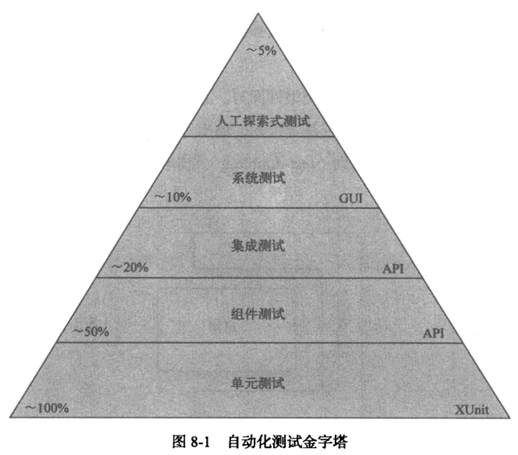
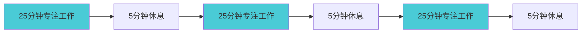
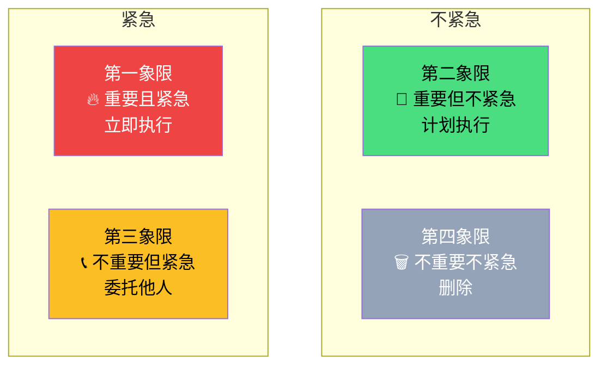
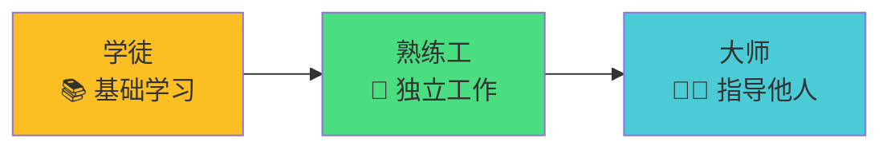

---
# You can also start simply with 'default'
theme: default
# some information about your slides (markdown enabled)
title: 《The Clean Coder》第5-14章读书分享
info: |
  ## Slidev Starter Template
  Presentation slides for developers.

  Learn more at [Sli.dev](https://sli.dev)
# apply unocss classes to the current slide
class: text-center
# https://sli.dev/features/drawing
drawings:
  persist: false
# slide transition: https://sli.dev/guide/animations.html#slide-transitions
transition: slide-left
# enable MDC Syntax: https://sli.dev/features/mdc
mdc: true
# open graph
# seoMeta:
#  ogImage: https://cover.sli.dev
---

# 《The Clean Coder》第5-14章读书分享

分享人：林灏均

<div @click="$slidev.nav.next" class="mt-12 py-1" hover:bg="white op-10">
  Press Space for next page <carbon:arrow-right />
</div>

---
transition: fade-out
---

# 目录

- 📝 **测试驱动开发** - 每个开发人员都要适应和掌握的开发模式
- 🎨 **练习** - 保持自己的技能不落伍
- 🧑‍💻 **验收测试** - 沟通、澄清、精确化
- 🤹 **测试策略** - QA 应该找不到任何错误
- 🎥 **时间管理** - 高效地工作
- 📤 **预估** - 提供可信的预估结果
- 🛠 **压力** - 回避与应对压力的方法
- 🤝 **协作** - 学会交流
- 💻 **团队与项目** - 团队比项目更难构建
- 🧑‍🎓 **辅导、学徒期与技艺** - 建立成熟的成长机制
- 💾 **总结**

<style>
h1 {
  background-color: #4acbd6;
  background-size: 100%;
  -webkit-background-clip: text;
  -moz-background-clip: text;
  -webkit-text-fill-color: transparent;
  -moz-text-fill-color: transparent;
}
</style>

---
transition: slide-up
level: 2
---

# 第五章：测试驱动开发(TDD)

TDD 是一种软件开发方法，它要求开发人员在编写实际代码之前编写测试用例。

## TDD 的三项法则
1. 在编写不能通过的单元测试之前，不能编写产品代码。
2. 只要有一个单元测试失败，就不应该再编写测试代码。
3. 产品代码恰好能够让当前失败的单元测试成功即可，不要多写

## TDD 的好处
1. 确定性 - 如果这些测试全部通过，我就确信它可以随时交付
2. 缺陷注入率 - 减少 bug 数量
3. 勇气 - 拥有一套值得信赖的测试，便可完全打消对修改代码的全部恐惧
4. 文档 - 测试代码本身就是文档，用代码描述系统的用法
5. 设计 - 测试代码会迫使你思考如何设计系统

<style>
h1, h2 {
  color: #4acbd6;
  margin-bottom: 20px;
}

h2, #slideshow > div.slidev-page.slidev-page-3 > div > h2:nth-child(3) {
  margin-bottom: 10px;
  margin-top: 30px;
}

</style>

---
transition: slide-up
level: 2
---

# TDD 实践示例

````md magic-move {lines: true}
```ts
// 第一步：编写第一个失败测试 - 用户注册成功
describe('UserRegistration', () => {
  test('should register user with valid email and password', async () => {
    const userService = new UserRegistrationService()
    const result = await userService.register('test@example.com', 'password123')
    
    expect(result.success).toBe(true)
    expect(result.user.email).toBe('test@example.com')
    expect(result.user.id).toBeDefined()
  })
})

// ❌ 测试失败：UserRegistrationService 不存在
```

```ts
// 第二步：编写最少代码让测试通过
interface User {
  id: string
  email: string
}

interface RegistrationResult {
  success: boolean
  user?: User
  error?: string
}

class UserRegistrationService {
  async register(email: string, password: string): Promise<RegistrationResult> {
    return {
      success: true,
      user: { id: '1', email: 'test@example.com' } // 硬编码
    }
  }
}

// ✅ 测试通过
```

```ts
// 第三步：继续添加更多验证规则
class UserRegistrationService {
  async register(email: string, password: string): Promise<RegistrationResult> {
    return {
      success: true,
      user: { id: '1', email: 'test@example.com' }
    }
  }
}

describe('UserRegistration', () => {
  test('should register user with valid email and password', async () => {
    const userService = new UserRegistrationService()
    const result = await userService.register('test@example.com', 'password123')
    expect(result.success).toBe(true)
  })
  
  test('should reject invalid email format', async () => {
    const userService = new UserRegistrationService()
    const result = await userService.register('invalid-email', 'password123')
    expect(result.success).toBe(false) // ❌ 失败
    expect(result.error).toBe('Invalid email format')
  })
})
```

```ts
// 第四步：编写最少代码让测试通过
class UserRegistrationService {
  private isValidEmail(email: string): boolean {
    const emailRegex = /^[^\s@]+@[^\s@]+\.[^\s@]+$/
    return emailRegex.test(email)
  }

  async register(email: string, password: string): Promise<RegistrationResult> {
    if (!this.isValidEmail(email)) {
      return { success: false, error: 'Invalid email format' }
    }
    
    return {
      success: true,
      user: { id: '1', email }
    }
  }
}

// ✅ 所有测试通过
```
````

<style>
h1, h2 {
  color: #4acbd6;
  margin-bottom: 20px;
}

h2, #slideshow > div.slidev-page.slidev-page-3 > div > h2:nth-child(3) {
  margin-bottom: 10px;
  margin-top: 30px;
}

</style>

---
level: 2
---

# TDD 的局限性
- ⏰ **需要额外的时间和精力** - 编写测试用例需要额外的时间和精力，这可能导致开发速度变慢。
- 📝 **测试用例的质量问题** - 如果测试用例不够全面或不够准确，可能会导致代码质量不佳。
- 🧑‍🎓 **对新手不友好** - TDD需要一定的技能和经验，对于新手可能会比较困难。

<style>
h1, h2 {
  color: #4acbd6;
  margin-bottom: 20px;
}

h2, #slideshow > div.slidev-page.slidev-page-3 > div > h2:nth-child(3) {
  margin-bottom: 10px;
  margin-top: 30px;
}
</style>

---
class: px-20
---

# 第六章：练习

职业程序员通常会受到一种限制，即所解决问题的种类比较单一。老板通常只强调一种语言、一种平台，以及程序员的专门领域。经验不够丰富的程序员，履历和思维中都存在某种贻害无穷的盲区。经常可以看到这样的情景：程序员发现，面对行业的周期性变化造成的新局面，自己并没有做好准备。

## 关于练习的职业道德
- 职业程序员用自己的时间来练习
- 不必限制在工作的语言和平台

## 推荐的练习网站
- https://leetcode.cn/
- https://bigfrontend.dev/
- https://learngitbranching.js.org/

<style>
h1, h2 {
  color: #4acbd6;
  margin-bottom: 20px;
}

h2, #slideshow > div.slidev-page.slidev-page-3 > div > h2:nth-child(3) {
  margin-bottom: 10px;
  margin-top: 30px;
}
</style>

---

# 第七章：验收测试
验收测试是由业务方与开发方共同编写的自动化测试，用于确认需求已完成并可作为交付依据

## 验收测试的目的

- 📋 **沟通** - 业务方和开发方就需求达成一致理解
- 🔍 **澄清** - 消除需求中的模糊和歧义
- 📐 **精确化** - 将业务规则转化为可执行的规范

## 验收测试的特点

- ✅ **业务导向** - 从用户角度验证功能是否符合预期
- 🤝 **协作编写** - 业务分析师、测试人员、开发人员共同参与
- 🔄 **持续执行** - 作为回归测试的一部分持续运行
- 📝 **活文档** - 既是测试也是需求文档

<style>
h1, h2 {
  color: #4acbd6;
  margin-bottom: 20px;
}

h2 {
  margin-bottom: 10px;
  margin-top: 30px;
}
</style>

---
level: 2
---

# 验收测试 vs 单元测试

| 对比维度 | 验收测试 | 单元测试 |
|---------|---------|---------|
| **关注点** | 业务功能是否正确 | 代码逻辑是否正确 |
| **编写者** | 业务方+开发方协作 | 开发人员 |
| **测试范围** | 端到端功能验证 | 单个函数/类 |
| **语言** | 业务领域语言(Gherkin) | 编程语言 |
| **执行速度** | 相对较慢 | 非常快 |
| **测试环境** | 接近生产环境 | 隔离的测试环境 |
| **测试数据** | 真实或接近真实的数据 | 模拟数据 |
| **依赖关系** | 涉及多个系统组件 | 最小化外部依赖 |

<style>
h1, h2 {
  color: #4acbd6;
  margin-bottom: 20px;
}

h2 {
  margin-bottom: 10px;
  margin-top: 30px;
}

table {
  font-size: 0.9em;
}

th {
  background-color: #4acbd6;
  color: white;
  padding: 12px 8px;
}

td {
  padding: 10px 8px;
  border-bottom: 1px solid #e2e8f0;
}

tr:nth-child(even) {
  background-color: #f8fafc;
}
</style>

---
level: 2
---

# 验收测试 vs 单元测试：代码示例

<div class="grid grid-cols-2 gap-8 h-full">

<div>

## 验收测试
**特点**: 从用户角度验证完整业务流程

```gherkin
Feature: 用户登录
Scenario: 用户登录成功
  Given 存在用户"john@example.com"
  When 用户输入正确的邮箱和密码
  Then 用户应该成功登录
  And 跳转到首页
  And 显示欢迎信息
```

</div>

<div>

## 单元测试
**特点**: 验证单个组件的内部逻辑

```typescript
describe('EmailValidator', () => {
  test('should validate email format', () => {
    const validator = new EmailValidator()
    
    expect(validator.isValid('test@example.com'))
      .toBe(true)
    expect(validator.isValid('invalid-email'))
      .toBe(false)
    expect(validator.isValid(''))
      .toBe(false)
  })
})
```

</div>

</div>

## 两者的关系

- **验收测试** 确保我们构建了**正确的产品** ✅
- **单元测试** 确保我们**正确地构建**了产品 🔧
- 两者互补，共同构成完整的测试体系 🏗️

<style>
h1, h2 {
  color: #4acbd6;
  margin-bottom: 20px;
}

h2 {
  margin-bottom: 10px;
  margin-top: 30px;
}

table {
  font-size: 0.9em;
}

th {
  background-color: #4acbd6;
  color: white;
  padding: 12px 8px;
}

td {
  padding: 10px 8px;
  border-bottom: 1px solid #e2e8f0;
}

tr:nth-child(even) {
  background-color: #f8fafc;
}
</style>

---
transition: slide-up
level: 2
---

# 第八章：测试策略
专业的开发团队应该建立完整的测试策略，确保软件质量。理想情况下，QA应该找不到任何错误。

## 测试策略的目标

- 🎯 **零缺陷交付** - QA应该找不到任何错误
- 🔄 **快速反馈** - 尽早发现和修复问题
- 📈 **持续改进** - 不断优化测试覆盖率和效率
- 🛡️ **风险控制** - 降低生产环境出现问题的风险



<style>
h1, h2 {
  color: #4acbd6;
  margin-bottom: 20px;
}

h2 {
  margin-bottom: 10px;
  margin-top: 30px;
}
</style>

---
level: 2
---

# 第九章：时间管理
时间是程序员最宝贵的资源。专业的程序员知道如何高效地管理时间，避免浪费，专注于真正重要的工作。

## 时间管理的重要性

<div class="grid grid-cols-2 gap-6">

<div>

### 为什么重要？
- ⏰ **有限资源** - 每天只有8小时工作时间
- 🎯 **效率决定价值** - 高效工作创造更大价值  
- 🧠 **认知负荷** - 大脑处理能力有限
- 💰 **成本控制** - 时间就是金钱

### 常见时间浪费
- 📱 **干扰和中断** - 频繁的打断破坏专注
- 🤔 **优先级不清** - 在不重要的事情上花费时间
- 🔄 **重复工作** - 缺乏自动化和工具
- 😴 **疲劳工作** - 在状态不佳时强行工作

</div>

<div>

### 时间管理的核心原则

- 🎯 **专注于重要且紧急的任务**
- ⚡ **在精力最佳时处理最难的问题**
- 🚫 **学会说"不"，拒绝不必要的会议和任务**
- 🔄 **批量处理相似的任务**

</div>

</div>

<style>
h1, h2, h3 {
  color: #4acbd6;
  margin-bottom: 15px;
}

h2 {
  margin-top: 25px !important;
}
</style>

---
level: 2
---

# 会议管理：最大的时间杀手

会议是程序员时间管理中最需要注意的环节。不必要的会议会严重影响开发效率。

## 会议的成本
会议成本 = 会议时间 * 参与人数 * 参与人的平均工资（元/小时）

## 会议类型评估
| 会议类型 | 必要性 | 建议 |
|---------|-------|------|
| **站会** | ⭐⭐⭐⭐ | 保持简短(15分钟) |
| **需求评审** | ⭐⭐⭐ | 充分准备，明确目标 |
| **技术分享** | ⭐⭐ | 可选参加，录制回放 |
| **状态汇报** | ⭐ | 用邮件或工具替代 |

<style>
h1, h2 {
  color: #4acbd6;
  margin-bottom: 10px;
}

h2 {
  margin-bottom: 5px !important;
  margin-top: 20px !important;
}
</style>

---

## 拒绝无用会议
- ❌ **无议程的会议**
- ❌ **超过8人的讨论会**
- ❌ **没有明确目标的会议**
- ❌ **可以邮件解决的问题**

## 会议效率提升
- 📋 **明确议程** - 提前发送会议议程
- ⏰ **控制时间** - 严格按时开始和结束
- 🎯 **聚焦目标** - 避免偏离主题
- 📝 **记录决策** - 明确行动项和负责人
- 🚫 **可选参与** - 只邀请必要的人员

<style>
h1, h2 {
  color: #4acbd6;
  margin-bottom: 10px;
}

h2 {
  margin-bottom: 5px;
  margin-top: 20px;
}
</style>

---

# 番茄工作法
番茄工作法是一种时间管理方法，它将工作时间划分为25分钟的工作块，每个工作块后休息5分钟。



## 番茄工作法的好处
- 🔄 **专注** - 25分钟专注工作，提高效率
- 🧠 **减少压力** - 5分钟休息，缓解疲劳
- 💪 **拒绝干扰** - 在25分钟的高效工作时间段里，你有底气拒绝任何干扰
- 📅 **促进任务分解与时间管理** - 将大任务拆解成多个番茄钟，每个番茄钟都有明确的目标，使得任务不再显得复杂和压倒性。

<style>
h1, h2 {
  color: #4acbd6;
  margin-bottom: 20px;
}

h2 {
  margin-bottom: 10px;
  margin-top: 30px;
}
</style>

---

# 优先级管理：重要性矩阵

不是所有的任务都同等重要。学会区分任务的优先级是高效工作的关键。

## 紧急性/重要性矩阵

<div class="grid grid-cols-2 gap-8">

<div>



</div>

</div>

专业开发人员会评估每个任务的优先级，排除个人的喜好和需要，按照真实的紧急程度来执行任务

<style>
h1, h2 {
  color: #4acbd6;
  margin-bottom: 20px;
}

h2 {
  margin-bottom: 10px;
  margin-top: 30px;
}
</style>
---

# 第十章：预估
预估是软件开发中最困难的任务之一。专业程序员需要学会提供可信的预估结果。

## 什么是预估？

<div class="grid grid-cols-2 gap-8">

<div>

### 预估 ≠ 承诺
- 📊 **预估** - 基于概率的猜测
- 🤝 **承诺** - 必须完成的约定
- ⚠️ **区别很重要** - 混淆两者会导致问题

### 预估的本质
- 🎲 **概率分布** - 不是单一数字
- 📈 **不确定性** - 存在风险和变数
- 🔄 **持续更新** - 随着信息增加而调整

</div>

<div>

### 为什么预估困难？
- 🧩 **复杂性** - 软件系统复杂度高
- 🔍 **未知因素** - 需求变化、技术难题
- 🧠 **认知偏差** - 过度乐观、锚定效应
- 📚 **经验不足** - 缺乏类似项目经验

</div>

</div>

<style>
h1, h2, h3 {
  color: #4acbd6;
  margin-bottom: 15px;
}

h2 {
  margin-top: 25px;
}
</style>

---
level: 2
---

# 预估技术

## PERT三点预估法
**公式**: 预期时间 = (乐观时间 + 4×最可能时间 + 悲观时间) ÷ 6

| 场景 | 乐观(O) | 最可能(M) | 悲观(P) | 预期时间 |
|------|---------|-----------|---------|----------|
| 登录功能 | 1天 | 3天 | 8天 | **3.5天** |
| 支付模块 | 3天 | 7天 | 15天 | **7.7天** |
| 数据迁移 | 2天 | 5天 | 20天 | **6.7天** |

## 其他预估方法

- 🔢 **计划扑克** - 团队协作预估，减少偏差
- 📊 **历史数据** - 基于过往项目的实际数据
- 🧩 **任务分解** - 将大任务拆分为小任务

<style>
h1, h2 {
  color: #4acbd6;
  margin-bottom: 20px;
}

h2 {
  margin-bottom: 10px !important;
  margin-top: 20px !important;
}

table {
  font-size: 0.9em;
}

th {
  background-color: #4acbd6;
  color: white;
  padding: 12px 8px;
}

td {
  padding: 10px 8px;
  border-bottom: 1px solid #e2e8f0;
}

tr:nth-child(even) {
  background-color: #f8fafc;
}
</style>

---
level: 2
---

# 预估的最佳实践

## 沟通技巧

<div class="grid grid-cols-2 gap-8">

<div>

### ❌ 错误的表达
- "这个很简单，1天就能搞定"
- "应该不会超过1周"
- "差不多3天吧"

<br>
<br>

### ✅ 正确的表达
- "根据当前信息，我预估需要2-5天"
- "有90%的把握在1周内完成"
- "最乐观2天，最悲观1周，最可能4天"

</div>

<div>

### 预估原则
- 🎯 **诚实透明** - 不隐瞒风险和不确定性
- 📊 **提供区间** - 给出最小值和最大值
- 🔄 **及时更新** - 当情况变化时重新预估
- 📝 **记录假设** - 说明预估基于的前提条件

</div>

</div>

<style>
h1, h2, h3 {
  color: #4acbd6;
  margin-bottom: 15px;
}

h2 {
  margin-top: 20px;
}
</style>

---

# 第十一章：压力
压力是软件开发中不可避免的现象。专业程序员需要学会识别、回避和应对压力。

## 压力的来源

<div class="grid grid-cols-2 gap-8">

<div>

### 外部压力
- ⏰ **紧急的截止日期** - 不合理的时间要求
- 📈 **不断变化的需求** - 频繁的需求调整
- 👥 **人员不足** - 团队资源紧张
- 🎯 **过高的期望** - 超出能力范围的目标

### 内部压力
- 😰 **完美主义** - 过度追求完美
- 🤔 **技术焦虑** - 担心技能不足
- 💭 **冒名顶替综合症** - 怀疑自己的能力
- 🔄 **工作生活失衡** - 过度工作

</div>

<div>

### 压力的危害
- 🧠 **思维混乱** - 影响判断和决策
- 🐛 **错误增加** - 代码质量下降
- 😴 **效率降低** - 工作产出减少
- 🏥 **健康问题** - 身心健康受损

</div>

</div>

<style>
h1, h2, h3 {
  color: #4acbd6;
  margin-bottom: 15px;
}

h2 {
  margin-top: 15px !important;
}
</style>

---
level: 2
---

## 应对压力的策略

<div class="grid grid-cols-2 gap-8">

<div>

### 预防措施
- 📋 **合理规划** - 制定现实可行的计划
- 🎯 **明确优先级** - 专注最重要的任务
- 💬 **及时沟通** - 提前报告风险和问题
- 🚫 **学会拒绝** - 拒绝不合理的要求

</div>

<div>

### 减少压力
- 🧘 **保持冷静** - 深呼吸，理性分析
- 🎯 **专注当下** - 一次只做一件事
- 💪 **寻求帮助** - 向同事或领导求助
- 🔄 **调整策略** - 灵活应对变化

</div>

</div>

## 专业态度
> "压力下的优雅是专业程序员的标志。当压力来临时，要遵循训练和纪律，而不是恐慌。"

- ✅ **坚持原则** - 不因压力而降低代码质量
- 🤝 **团队协作** - 压力下更需要团队合作

<style>
h1, h2, h3 {
  color: #4acbd6;
  margin-bottom: 15px;
}

h2 {
  margin-top: 15px !important;
}

blockquote {
  border-left: 4px solid #4acbd6;
  padding-left: 16px;
  font-style: italic;
  margin: 20px 0;
  background-color: #f8fafc;
  padding: 16px;
}
</style>

---

# 第十二章：协作
编程是一项团队运动。专业程序员必须学会与他人有效协作，包括程序员、测试人员、业务分析师和项目经理。

<div class="grid grid-cols-2 gap-8">

<div>

## 协作的角色
- 👨‍💻 **程序员** - 实现功能，保证质量
- 🧪 **测试人员** - 验证功能，发现缺陷
- 📊 **项目经理** - 进度管理，资源协调
- 🎨 **设计师** - 用户体验，界面设计

</div>

<div>

## 与程序员协作的技巧
- 👀 **代码审查** - 认真review他人代码
- 💡 **知识分享** - 主动分享技术经验
- 🆘 **互相帮助** - 遇到困难时寻求帮助
- 📚 **文档维护** - 共同维护技术文档

## 与其他人协作的技巧
- 🗣️ **使用业务语言** - 避免程序员技术术语
- 📊 **可视化展示** - 用图表、原型说明
- ❓ **主动提问** - 确保理解需求

</div>

</div>

<style>
h1, h2, h3 {
  color: #4acbd6;
  margin-bottom: 15px;
}

h2 {
  margin-top: 25px !important;
}
</style>

---

# 第十三章：团队与项目
团队比项目更难构建，但也更有价值。专业的软件组织应该围绕团队而非项目来组织工作。

<div class="grid grid-cols-2 gap-12">

<div>

## 团队 vs 项目

| 维度 | 团队 | 项目 |
|------|------|------|
| **持续性** | 🔄 长期稳定 | ⏰ 临时性 |
| **目标** | 🎯 持续价值创造 | 📦 特定交付物 |
| **成本** | 💰 构建成本高 | 💸 组建成本低 |
| **效率** | 📈 越来越高效 | 📊 效率波动大 |
| **知识** | 🧠 知识积累 | 📚 知识流失 |

</div>

<div>

## 核心观点

### 🏗️ 团队建设优先
- 先组建稳定的团队
- 再让团队承接多个项目
- 避免项目结束就解散团队

### 🎯 实施建议
- 保持团队稳定性（12-18个月以上）
- 让项目适应团队，而非团队适应项目
- 投资团队建设和技能培养

</div>

</div>

<style>
h1, h2, h3 {
  color: #4acbd6;
  margin-bottom: 15px;
}

h2 {
  margin-top: 10px;
}

h3 {
  margin-top: 10px;
}

table {
  font-size: 0.9em;
  width: 100%;
}

th {
  background-color: #4acbd6;
  color: white;
  padding: 8px;
  text-align: center;
}

td {
  padding: 8px;
  border-bottom: 1px solid #e2e8f0;
  text-align: center;
}

tr:nth-child(even) {
  background-color: #f8fafc;
}
</style>

---

# 第十四章：辅导、学徒期与技艺
软件开发是一门技艺，需要通过师傅带徒弟的方式传承。建立成熟的人才培养机制是行业发展的关键。

## 学徒制培养体系

<div class="grid grid-cols-2 gap-12 my-8">

<div>

### 三个阶段


</div>

<div>

### 🎯 培养要点
- **学徒期** - 跟随经验丰富的导师学习
- **实践为主** - 在真实项目中学习成长
- **逐步承担** - 从简单任务到复杂项目
- **持续反馈** - 及时指导和纠正错误

</div>

</div>

<p>"学校教育只是起点，真正的技艺需要在实践中通过师傅的指导来获得。每个大师都有责任培养下一代的技艺传承者。"</p>

<style>
h1, h2, h3 {
  color: #4acbd6;
  margin-bottom: 15px;
}

h2 {
  margin-top: 20px !important;
}

ul {
  list-style: none;
  padding-left: 0;
}

li {
  margin-bottom: 4px;
}
</style>

---

# 总结

通过学习《The Clean Coder》第5-14章，我们了解了成为专业程序员的关键要素。

## 🎯 专业程序员的三大支柱

<div class="grid grid-cols-2 gap-12">

<div>

<div class="space-y-6">

<div class="p-4 bg-blue-50 rounded-lg">
<h3 class="text-lg font-bold text-blue-800">🏆 专业精神</h3>
<p class="text-blue-700">对代码质量负责，坚持技术原则，持续学习成长</p>
</div>

<div class="p-4 bg-green-50 rounded-lg">
<h3 class="text-lg font-bold text-green-800">🤝 团队协作</h3>
<p class="text-green-700">有效沟通，知识分享，共同创造价值</p>
</div>

</div>

</div>

<div>

<div class="space-y-6">

<div class="p-4 bg-purple-50 rounded-lg">
<h3 class="text-lg font-bold text-purple-800">📈 持续改进</h3>
<p class="text-purple-700">拥抱变化，优化流程，传承技艺</p>
</div>

</div>

</div>

</div>

<style>
h1, h2, h3 {
  color: #4acbd6;
  margin-bottom: 15px;
}

h2 {
  margin-top: 20px !important;
}

blockquote {
  border: none;
  font-style: italic;
  background: none;
  padding: 0;
  margin: 0;
}

.space-y-6 > * + * {
  margin-top: 1.5rem;
}
</style>

---
