# 第 7 章 使用语言：一个扩展的示例

本章通过一个货物运输系统，把前面学到的构造块模式串成一个完整案例。系统需要三项功能：跟踪 Cargo 的处理过程、预约新 Cargo、货物到达某位置后自动寄送发票。

## 初步模型

核心概念包括：Cargo 表示货物；Customer 表示客户，承担 shipper（托运人）、receiver（收货人）、payer（付款人）等角色；Handling Event 表示装船、卸货、清关等操作；Carrier Movement 表示承运工具从一个地点到另一个地点的旅程，其中一段旅程称为 Leg（航段）；Location 表示地点；Delivery Specification 定义运送目标；Delivery History 记录实际发生的情况。这些概念构成团队的 UBIQUITOUS LANGUAGE。

## 分层与职责

团队用 LAYERED ARCHITECTURE 把领域层隔离出来。应用层只负责协调，识别出三个应用类：Tracking Query 查询 Cargo 状态，Booking Application 注册新 Cargo，Incident Logging Application 记录处理事件。它们都是提问者，真正的业务判断在领域层。

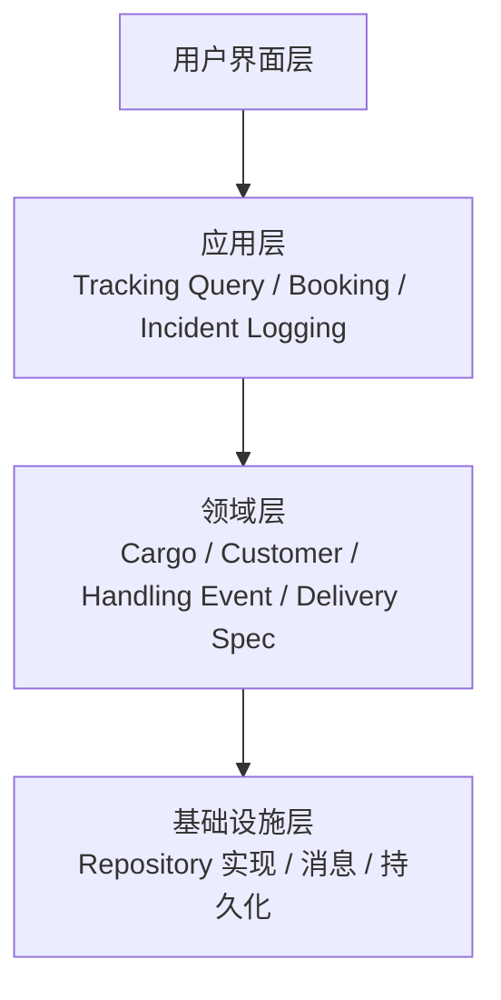

## ENTITY 与 VALUE OBJECT

Customer、Cargo、Handling Event、Carrier Movement、Location 是 ENTITY，因为它们需要被唯一识别。Delivery Specification、Role、时间戳等是 VALUE OBJECT。Delivery History 不可互换，但它与 Cargo 是一对一关系，标识派生自 Cargo，所以放在 Cargo AGGREGATE 内部。

## AGGREGATE 边界

Cargo 是 AGGREGATE 根，内部包含 Delivery History 和 Delivery Specification。Customer、Location、Carrier Movement 被多个 Cargo 共享，是独立的 AGGREGATE 根。Handling Event 最初放在 Cargo AGGREGATE 内，但后来因为存在独立业务查询，且添加 Handling Event 会与 Cargo 产生并发争用，被重构为独立的 AGGREGATE 根。

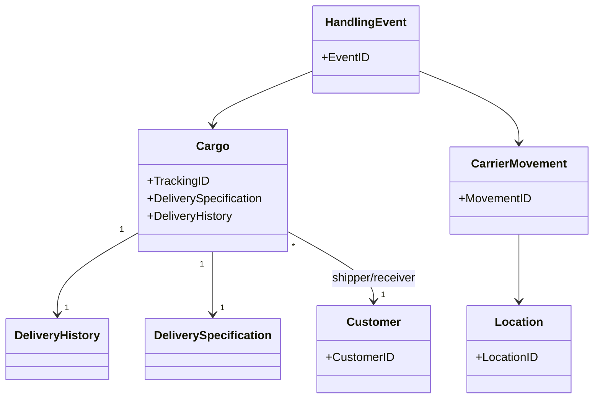

## REPOSITORY 与 FACTORY

只有真正需要全局访问的 AGGREGATE 根才建 REPOSITORY：Customer、Location、Carrier Movement、Cargo。第一版不为 Handling Event 建 REPOSITORY，因为通过 Delivery History 的集合就能满足需求。

Cargo 的构造函数或 FACTORY 负责创建满足固定规则的对象，同时创建与之双向关联的 Delivery History。Handling Event 的具体类型很多，在基类中为每种类型提供 FACTORY METHOD，客户端不必了解具体子类。

## 重构 Cargo AGGREGATE

添加 Handling Event 时需要同时更新 Delivery History，这会把 Handling Event 的事务牵涉到 Cargo AGGREGATE 中，导致并发争用。团队把 Delivery History 中的 Handling Event 集合改为通过 REPOSITORY 查询生成，Handling Event 成为独立 AGGREGATE 根。Delivery History 因此不再有持久状态，需要时生成即可。这个改动没有改模型本身，只是把实现折中控制在边界内。

## MODULE 划分

MODULE 应根据领域概念划分，而不是按 ENTITY/VALUE OBJECT/SERVICE 或持久/临时对象分包。例如按 Customer、Shipping、Billing 等业务概念分包，这些名称本身就会成为团队语言的一部分。

## 配额检查与外部系统集成

与销售管理系统集成时，引入 Allocation Checker 作为 ANTICORRUPTION LAYER，把外部系统的类别概念转换为领域模型中的 Enterprise Segment。Enterprise Segment 是一个 VALUE OBJECT，表示按业务维度对 Cargo 的划分。Cargo Repository 提供基于 Enterprise Segment 的查询，Allocation Checker 决定是否接受预订。这样外部系统的变化只影响到 Allocation Checker，不会污染领域模型的其他部分。

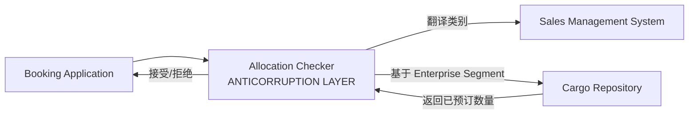

# 第 8 章 突破

突破不是技巧，而是持续重构后对领域本质的突然领悟。本章通过银团贷款系统的故事说明这一点。

## 项目背景

系统管理银团贷款：多家借贷公司联合向借款者提供巨额信贷，投资银行担任协调者，需要跟踪贷款承诺、提取、偿还、费用支付等流程。

## 领域名词解释

银团贷款中有一些专用术语。

**Facility（信贷/贷款承诺）**：银行或银团向借款者作出的借款承诺，规定了最高可借总额。它有点像信用卡额度——借款者可以在额度内多次提取资金，未提取部分不产生利息，但可能需要支付承诺费。

**Loan（贷款/已提贷款）**：借款者实际从 Facility 中提取出来的资金。一次 Facility 下可以有多次 Loan 提取，所有未偿还 Loan 的总和不能超过 Facility 的总额度。

**Drawdown（提款/提取）**：借款者从 Facility 中实际借出一笔资金的行为。每次 Drawdown 都会产生一笔新的 Loan。

**Facility 股份**：各放贷方在 Facility 总额中所占的承诺比例。例如一个 1 亿美元的 Facility，银行 A 占 50%，银行 B 占 30%，银行 C 占 20%。

**Loan 股份**：各放贷方在某一笔具体 Loan 中的实际出资比例。理论上可能按 Facility 股份分配，但实践中各放贷方可以协商调整。

**本金偿还**：借款者归还 Loan 本金。偿还金额按 Loan 股份分配给各放贷方，而不是按 Facility 股份分配。

**利息支付**：借款者为未偿 Loan 支付的利息。与本金偿还一样，按 Loan 股份分配。

**Facility 费用**：借款者为享有 Facility 权利而支付的费用，例如承诺费。费用按 Facility 股份分配，与放贷方是否实际借出钱无关。

**Loan Adjustment（贷款调整）**：旧模型中为修正 Facility 股份与 Loan 股份不一致而引入的概念，用于记录放贷方最初同意放贷的股份与实际放贷额之差。

**Share Pie（股份图）**：突破后引入的核心抽象，表示一笔总体价值在多个股东之间的分布。Facility 股份、Loan 股份、支付比例等都可以表示为 Share Pie。

**Transaction（交易）**：后续突破中引入的概念，表示一次金融交易，如提款、还款、付费等。

**Position（头寸）**：后续突破中提炼出的抽象，作为 Facility 和 Loan 的父类，统一表示银团中的某种资金头寸。

## 旧模型的问题

旧模型把 Facility 股份与 Loan 股份绑定，假定二者成正比。但实际业务中，借款者提取贷款时各放贷方通常按 Facility 股份支付，有时也协商调整实际投入。偿还本金和利息时按 Loan 股份分配，支付 Facility 费用时按 Facility 股份分配。为了弥补模型与现实的不一致，团队不断加入 Loan Adjustment 和特殊处理逻辑，模型越来越复杂，舍入误差也难以处理。

## 突破

团队突然意识到：Facility 股份与 Loan 股份不应该被绑定，它们可以独立变化。新模型引入 Share Pie 概念，表示某一总体价值在多个股东之间的分布。所有与股份有关的分配、支付、费用计算都用统一的「股份数学」处理。

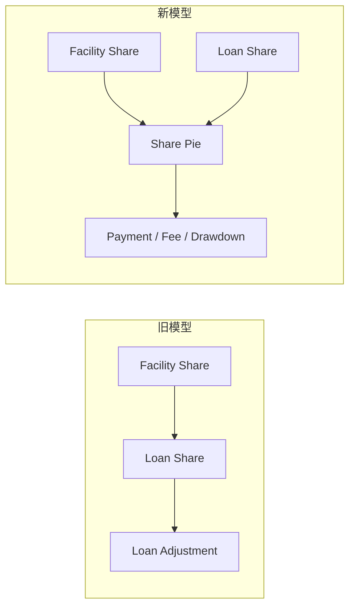

新模型删除了 Loan Investment 等人为概念，舍入问题自然消失，复杂代码被大量删除。Share Pie 成为整个团队、市场人员甚至客户都能理解的 UBIQUITOUS LANGUAGE。

## 决策与风险

突破通常需要一次性重构大量代码，风险高、压力大。作者团队用四个问题评估：新设计重新实现旧功能需要多久？不采用新设计能否解决问题？现在不改是否还能继续下个版本？这是不是正确的行动？当新设计更简单、更贴合业务、长期风险更低时，值得投入。团队估计需要三周，最终在三周内完成了重构。

## 后续突破

Share Pie 版本发布几周后，团队又发现提取贷款、缴纳费用等逻辑分散在 Facility 和 Loan 中，「交易」这个词反复出现却没有对应对象。于是又引入 Transaction 概念，并提炼出 Position 作为 Facility 和 Loan 的抽象。一次突破往往会带来更清晰的设计和更丰富的语言，进而促成下一次突破。

# 第 9 章 将隐式概念转变为显式概念

深层模型始于识别隐式概念。本章给出挖掘隐式概念的途径，以及三类应显式建模的概念。

## 挖掘途径

倾听领域专家的术语，如果设计中缺少他们常用的词，通常是改进模型的机会。检查复杂、笨拙、不断扩展的代码，这些往往是丢失概念的征兆。思考专家观点中的矛盾，不同看法可能揭示更深层的抽象。阅读领域文献，如会计学，可以提供成熟概念体系。最后要不断尝试，建模是试错过程。

## 倾听语言：Itinerary

在运输系统中，专家反复提到 Itinerary 即航海日程。一个 Itinerary 由多个 Leg（航段）组成，每个 Leg 描述一段从装货地到卸货地的运输，包含船名航次、港口、时间等信息。

开发人员最初只把 Itinerary 当报表，但进一步讨论发现它连接了预订应用和作业支持应用。于是将 Itinerary 建模为由 Leg 组成的显式对象。这个改变使 Routing Service 与数据库表解耦，预订报表和作业应用共享同一对象，领域逻辑回到领域层，UBIQUITOUS LANGUAGE 也更丰富。

## 检查不足：Accrual

金融投资跟踪程序中，Interest Calculator 越来越复杂。开发人员与专家讨论后意识到，利息收入和付款是彼此独立的过账。专家提到应计制会计：收入或支出在发生时入账，不管现金何时实际转移。团队引入 Accrual 概念，将利息、费用与付款分离。新模型中 Asset 根据 Accrual Schedule 生成 Accrual 集合，每笔 Accrual 过账到相应分类账。

## 三类应显式建模的概念

**约束**：把固定规则从宿主对象中提取出来。Bucket 的容量检查、Voyage 的超订策略都是例子。当约束所需数据不属于宿主对象，或在多个对象中重复出现，或大量讨论围绕它进行时，就应显式建模。

**过程**：当过程本身是业务概念时用 SERVICE 或 STRATEGY 表达。Routing Service 的路线安排、Packer 的仓库打包都是过程被显式建模的例子。

**SPECIFICATION**：把布尔规则封装为可复用、可组合的 VALUE OBJECT。例如拖欠发票规格、化学品仓库的 Container Specification。SPECIFICATION 有三种用途：验证对象、从集合中选择、按规格创建新对象。

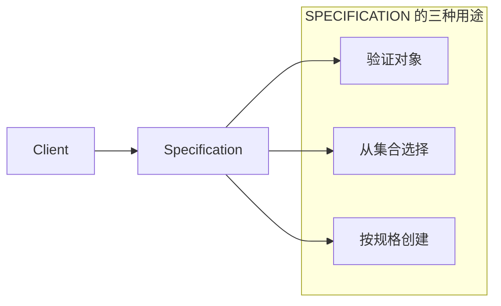

多个 Specification 可用 AND/OR/NOT 组合，形成复杂规则。还可以用「包容」判断一个规格是否比另一个更严格。

# 第 10 章 柔性设计

柔性设计让代码既表达深层模型，又易于修改和组合。本章给出六个相互关联的原则和模式。

## 释意接口

类名、方法名、参数名应描述效果和目的，不暴露实现方式。作者以调漆程序为例，最初方法名为 paint，阅读代码才知道是混合油漆；重构为 mixIn 后意图清晰。先写测试可以帮助从客户端视角思考接口。

## 无副作用函数

把查询/计算与命令分离。复杂计算应返回新的 VALUE OBJECT，而不是修改现有对象。由于 VALUE OBJECT 不可变，其操作天然无副作用，可以安全地组合和测试。调漆程序中，Pigment Color 被提取为 VALUE OBJECT，mixedWith 返回新的 Pigment Color，Paint 只保存结果。

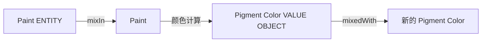

## 断言

ENTITY 中的命令会改变状态，用 ASSERTION 把副作用明确表达出来。后置条件描述方法调用后的结果，前置条件描述调用前必须满足的条件，不变规则描述对象始终应满足的状态。断言可以用语言特性、单元测试或文档表达。

## 概念轮廓

分解类和操作时不应机械追求粒度一致，而应寻找领域中自然存在的内聚边界。调漆应用中，用户只关心调配好的油漆，不会单独添加红、黄、蓝颜料；应计项目模型中，Schedule 被拆分到不同类中，而 Payment 被统一为一个概念。

## 独立类

减少不必要的依赖，把复杂计算提取到依赖最少的独立类中。VALUE OBJECT 是实现独立类的理想载体。Pigment Color 剥离后，可以独立分析、测试和复用。

## 闭合操作

适当让操作的参数类型和返回类型与实现者类型相同，不引入额外概念。Share Pie 的 plus、minus 是闭合操作，返回新的 Share Pie，Loan 中的股份计算因此可以用声明式风格编写。

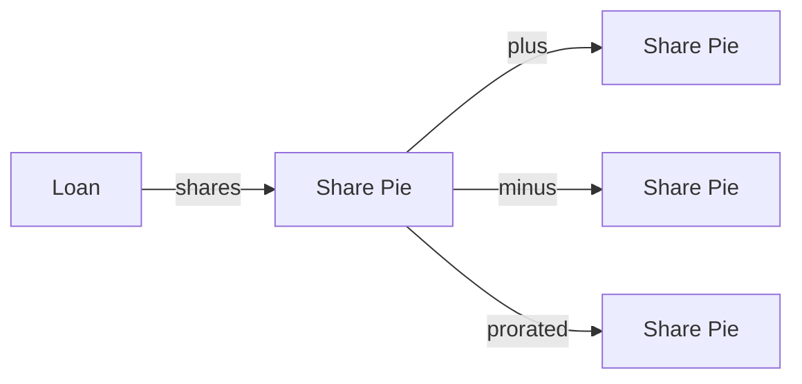

## 声明式风格

柔性设计的极致是声明式设计，但完整的声明式框架往往限制过多。更务实的做法是用释意接口、无副作用函数和断言构建声明式风格。SPECIFICATION 的组合就是一个例子，复杂规则可以用 AND/OR/NOT 以接近声明式的方式表达。

# 第 11 章 应用分析模式

分析模式是前人在特定业务领域中总结的概念模型模板，不是现成代码或框架。它们为建模提供起点、讨论词汇和对后期结果的预见。

## 一些术语

- **Account（账户）**：会计中用于记录与某类资金或价值有关变动的对象。
- **Entry（分录/项）**：账户中的一次增减记录，正数表示增加，负数表示减少。
- **Payment（付款）**：归还或支付资金的 Entry，表示现金实际流出或转入。
- **Accrual（应计项）**：在收入或支出发生时入账的 Entry，不管现金是否实际收付。例如利息每天都在产生，但月末才实际支付。
- **Ledger（分类账）**：按类别汇总 Entry 的账簿，例如收入账、费用账。
- **复式记账**：会计基本原则，每笔资金变动都有来源和去向，借方与贷方总额相等。
- **Posting Rule（过账规则）**：当某个账户发生 Entry 时，根据规则自动在另一个账户生成 Entry。

## 使用态度

不要照搬，要结合自身上下文调整。保持术语基本含义不变，以维护 UBIQUITOUS LANGUAGE。分析模式的价值在于借鉴抽象思想和实现经验，避免重复踩坑。

## 账户与 Entry

一个跟踪贷款和有息资产的应用中，夜间批处理计算利息和手续费。团队借鉴会计模型：Account 通过 Entry 记录每次修改，余额由 Entry 汇总。会计基本原则是账目的平衡，每个贷方都有相应借方，即复式记账。

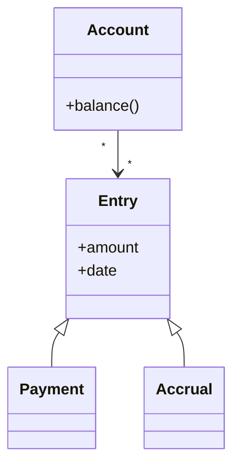

团队最初尝试用 Transaction 把利息和付款联系起来，但专家指出应计项目和付款在会计系统中是分开过账的。于是放弃 Transaction，将 Payment 和 Accrual 作为 Entry 子类。手续费和利息在概念上没有区别，只是出现在不同 Account 中。由于关系数据库映射限制，团队不得不创建 Fee Payment、Interest Payment 等具体子类，这是合理的实现折中。

## 过账规则

另一个开发人员修改夜间批处理程序时，发现其中隐含大量领域逻辑。他借鉴 Posting Rule 概念：当输入 Account 收到新 Entry 时，规则触发并在输出 Account 中生成新 Entry。

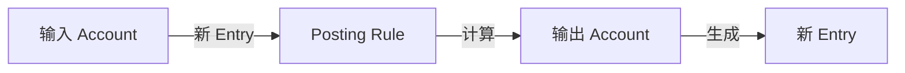

Fowler 提出三种触发模式：主动触发、基于 Account 触发、基于过账规则触发。选择哪种应成为 UBIQUITOUS LANGUAGE 的一部分。团队将批处理脚本中的逻辑提取为领域对象后，脚本只需依次访问 Asset 并发送简单消息，复杂性转移到领域层。

# 第 12 章 将设计模式应用于模型

《设计模式》中的某些模式既可解决技术问题，也可表达领域概念。判断标准是：它能否描述概念领域的某些事情，而不仅是解决技术问题。

## 一些术语

- **Route Specification（路线规格）**：描述一条路线需要满足的条件，如起点、终点、时间要求等。
- **Itinerary（航行日程/路线）**：由多个 Leg 组成的具体运输方案。
- **Leg（航段）**：运输路线中的一段，从一个地点到另一个地点。
- **Leg Magnitude Policy（航段规模策略）**：决定如何衡量每个 Leg 的规模，例如按时间或按成本。

## STRATEGY

当过程有多种实现方式时，把易变部分提取为策略对象。Routing Service 接收 Route Specification，构造满足条件的 Itinerary。最快路线、最便宜路线等选择被提取为 Leg Magnitude Policy，作为参数传入 Routing Service。

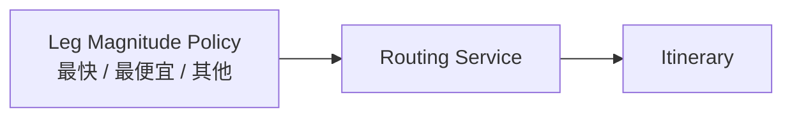

Routing Service 的接口因此保持简洁，新增策略无需修改其核心逻辑。当 STRATEGY 对应实际业务策略时，它既是实现技术，也是领域概念。

## COMPOSITE

当领域存在「整体由同类型部分组成」的递归结构时使用。货物运输路线中，大的 Route 由小的 Route 组成，小的 Route 最终由 Leg 组成，客户可以统一处理所有层级。

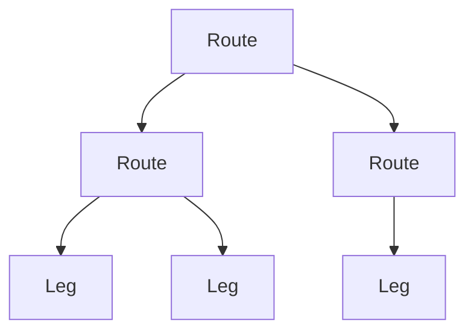

起初开发团队把 Route 和 Leg 作为不同类型处理，导致遍历和组合复杂。使用 COMPOSITE 后，生成操作计划、路线拼接、截断重组都变得简单。
