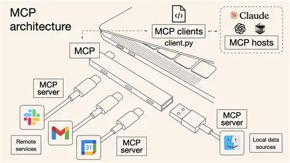
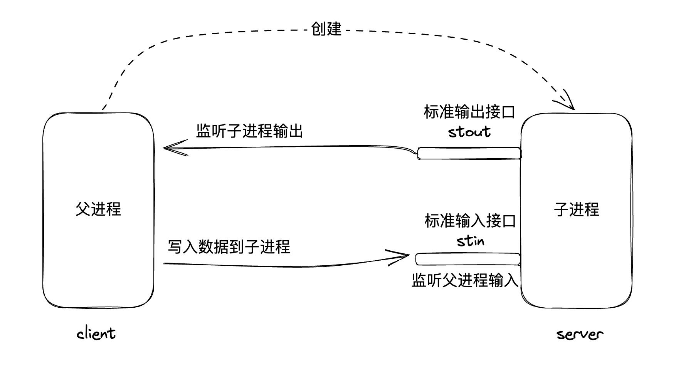
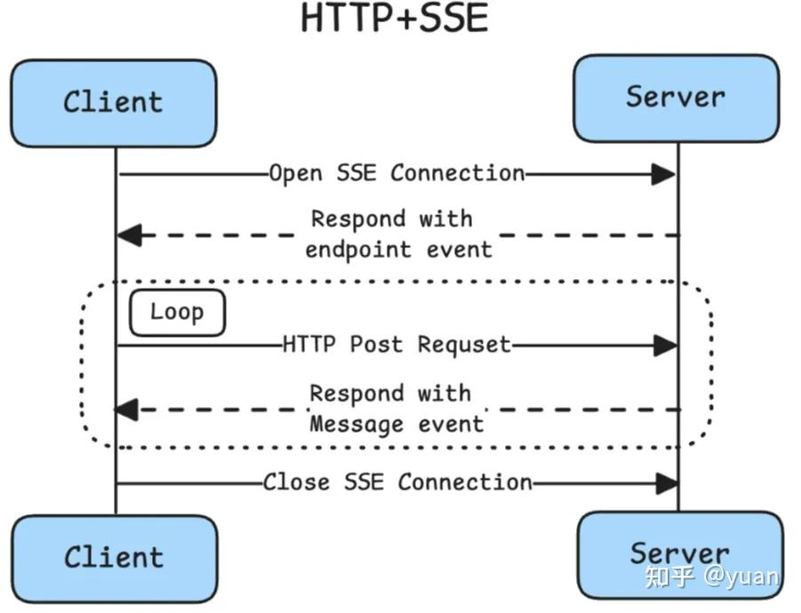
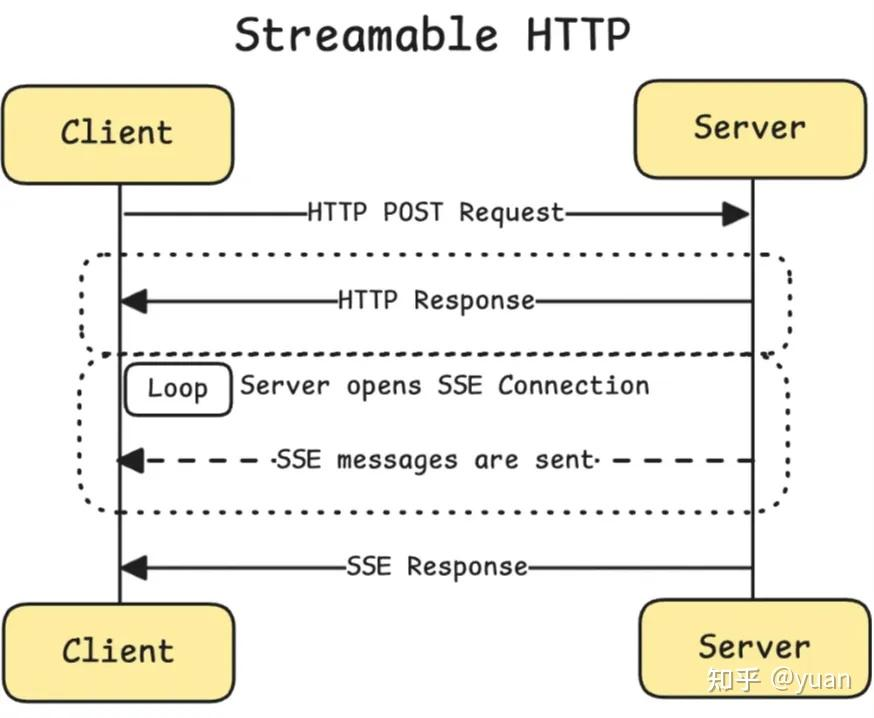
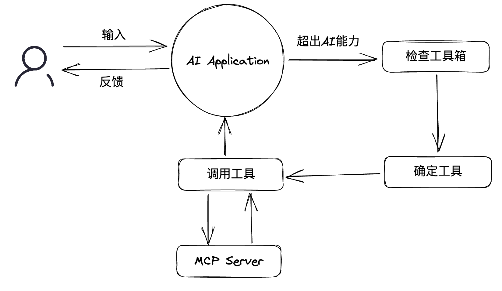
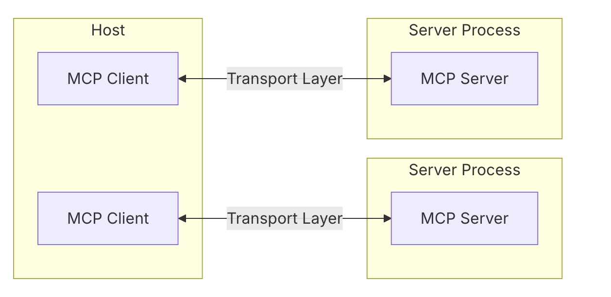

# MCP简单介绍

## 目录
- [MCP简单介绍](#mcp简单介绍)
  - [目录](#目录)
  - [定义](#定义)
  - [核心概念](#核心概念)
    - [通信方式](#通信方式)
      - [stdio](#stdio)
      - [HTTP + SSE](#http--sse)
      - [Streamable HTTP](#streamable-http)
    - [通信格式：JSON-RPC](#通信格式json-rpc)
  - [基本通信规范](#基本通信规范)
  - [开发与调试工具](#开发与调试工具)
    - [MCP Server 的调试工具](#mcp-server-的调试工具)
    - [MCP SDK](#mcp-sdk)
  - [对接AI应用程序](#对接ai应用程序)
    - [什么是AI应用程序？](#什么是ai应用程序)
    - [核心概念](#核心概念-1)
    - [接入流程](#接入流程)
    - [VSCode 使用 MCP 服务器示例](#vscode-使用-mcp-服务器示例)
  - [总结](#总结)
  - [相关网站](#相关网站)

---


## 定义

**MCP，全称 Model Context Protocol，模型上下文协议。旨在为AI与外部程序之间建立通信标准，使外部程序可部署到任意AI，也使AI应用可使用任意外部程序。**



---

## 核心概念

### 通信方式
MCP 协议支持三种通信方式，分别是 stdio、http + sse 以及 streamable http

#### stdio
stdio: standard input and output 标准输入输出：通过创建子进程的方式，父进程可以监听子进程标准输出接口的输出，以及写入数据到子进程的标准输入接口，一来一回实现进程间通信。



(node js 基础 demo 展示)

**优点**：高效、简洁，适合本地进程间通信
**缺点**：仅限本地，无法跨网络

#### HTTP + SSE
客户端通过 HTTP POST 发送请求，服务器通过一个单独的 SSE (Server-Sent Events) 端点推送响应，需要维护两个独立的连接。

HTTP + SSE 的工作流程：

- 客户端连接到服务器上的一个 "http://example.com/sse" 端点
- 服务器响应一个 "endpoint event"，告知客户端使用哪个 URI（例如 http://example.com/messages）来发送消息
- 客户端使用此 URI 与服务器通信
- 服务器通过 SSE 协议与客户端通信



**缺点**:
- 不支持恢复连接
- 要求服务器保持高可用的长连接
- 服务器只能通过 SSE 发送消息

#### Streamable HTTP
Streamable HTTP 是 MCP 协议定义的一种特定的、基于 HTTP 的传输机制或模式。Streamable HTTP 描述了如何利用 HTTP（特别是 POST 和 GET 方法）和可选的 SSE 技术，在 MCP 客户端和服务器之间实现双向的、可具备流式交互能力的消息交换。

Streamable HTTP 的工作流程：

- 客户端向服务端发送请求。
- 服务端自己决定是以标准的 HTTP 响应（HTTP Response）还是流式响应（SSE Response）的形式返回。



### 通信格式：JSON-RPC
JSON-RPC 是一种轻量级的 RPC（远程过程调用）协议，基于 JSON 格式进行数据传输，广泛用于服务端与客户端之间的通信。

**主要特点：**
- 无需指定的传输层，通常可通过 HTTP、WebSocket、stdio 等方式承载
- 请求和响应均为标准 JSON 对象，易于解析和调试
- 支持方法调用、参数传递、结果返回和错误处理

**优点：**

  - **简单易用:**  JSON 格式易于理解和解析。
  - **跨平台/跨语言:**  JSON 的广泛支持使得 JSON-RPC 可以应用于不同的编程语言和平台。
  - **无状态:**  每个请求都是独立的，服务器不需要维护客户端的状态。

**缺点：**

  - **缺乏内置的安全性:**  JSON-RPC 本身不提供安全性保障，需要依赖传输层协议 (例如 HTTPS) 来实现加密通信。
  - **缺乏服务发现机制:**  JSON-RPC 没有内置的服务发现机制，需要手动配置服务器地址。
  - **缺乏接口定义语言:**  JSON-RPC 没有标准的接口定义语言，需要手动定义接口。

**JSON-RPC 协议请求响应示例：**

`request`

```json
{
  // 表示 JSON-RPC 协议的版本，不同的版本格式有细微差别
  "jsonrpc": "2.0",
  // 希望调用的方法名字
  "method": "sum",
  // 调用方法传入的参数
  "params": {
    "a": 5,
    "b": 6
  },
  // 请求表示，通过响应的 id 字段判断是哪一次的响应
  "id": 1
}
```

`response`

```json
{
  "jsonrpc": "2.0",
  // 调用的结果
  "result": 11,
  "id": 1
}
```

---

## 基本通信规范

1. **初始化 `initialize`**

   客户端与服务端建立连接，交换能力信息。

   `request`
   ```json
   {
     "jsonrpc": "2.0",
     "id": 1,
     "method": "initialize",
     "params": {
      "protocolVersion": "2024-11-05",
      "capabilities": {
        "roots": {
          "listChanged": true
        },
        "sampling": {},
        "elicitation": {}
      },
      "clientInfo": {
        "name": "ExampleClient",
        "title": "Example Client Display Name",
        "version": "1.0.0"
      }
    }
   }
   ```

   `response`
   ```json
   {
     "jsonrpc": "2.0",
     "id": 1,
     "result": {
       "protocolVersion": "2024-11-05",
       "capabilities": {
        "logging": {},
        "prompts": {
          "listChanged": true
        },
        "resources": {
          "subscribe": true,
          "listChanged": true
        },
        "tools": {
          "listChanged": true
        }
      },
      "serverInfo": {
        "name": "ExampleServer",
        "title": "Example Server Display Name",
        "version": "1.0.0"
      },
      "instructions": "Optional instructions for the client"
    }
   }
   ```

2. **工具发现 `tools/list`**

   查询服务端可用工具。

   `request`
   ```json
   {
     "jsonrpc": "2.0",
     "id": 1,
     "method": "tools/list",
     "params": {}
   }
   ```

   `response`
   ```json
   {
     "jsonrpc": "2.0",
     "id": 1,
     "result": {
       "tools": [
         {
           "name": "get_weather",
           "title": "Weather Information Provider",
           "description": "Get current weather information for a location",
           "inputSchema": {
             "type": "object",
             "properties": {
               "location": { "type": "string", "description": "City name or zip code" }
             },
             "required": ["location"]
           }
         }
       ]
     }
   }
   ```

3. **工具调用 `tools/call`**

   调用指定工具。

   `request`
   ```json
   {
     "jsonrpc": "2.0",
     "id": 2,
     "method": "tools/call",
     "params": {
       "name": "get_weather",
       "arguments": { "location": "New York" }
     }
   }
   ```

   `response`
   ```json
   {
     "jsonrpc": "2.0",
     "id": 2,
     "result": {
       "content": [
         { "type": "text", "text": "72°F" }
       ]
     }
   }
   ```

---

## 开发与调试工具


### MCP Server 的调试工具

直接运行
```shell
npx @modelcontextprotocol/inspector
```

(演示调试工具使用方法)

### MCP SDK

使用`@modelcontextprotocol/sdk`可以更方便地开发`MCP Server`
```shell
npm install @modelcontextprotocol/sdk
```

(mcp sdk demo)

---

## 对接AI应用程序

### 什么是AI应用程序？

所有能与大模型交互的应用都可以看作是AI应用程序

**常见的AI应用程序：**
- ChatGPT
- DeepSeek
- Claude Desktop（支持MCP协议，可充当MCP客户端）  
  [下载地址](https://claude.ai/download)
- VSCode（支持MCP协议，可充当MCP客户端）
- Cursor（支持MCP协议，可充当MCP客户端）
  [下载地址](https://cursor.com/cn)

下面这张图展示了用户，AI 应用与 MCP 服务器的工作流程。当用户向 AI 助手输入提示词后（如今天天气怎么样），如果对应的需求超出了 AI 的能力，就会检查当前 Host 的 MCP Server 工具箱，判断使用哪个工具后，AI 助手会将请求（如 tools/call）发送给 Host 内部的 MCP Client。MCP Client 负责与 MCP Server 建立连接、发现工具、发送调用请求，并将结果返回给 Host。
Host 再将结果展示给用户。


### 核心概念

- **MCP Host**：AI应用本身，用于发现MCP Server及工具列表
- **MCP Client**：与MCP Server通信的客户端，通常由Host内部启动，



### 接入流程

1. 在AI应用中打开新的会话窗口
2. Host发现已启用的MCP Server
3. Host为每个MCP Server创建一个Client
4. 每个Client分别启动各自的MCP Server，准备通信
5. Client调用工具并将结果传递给Host
6. Host根据结果处理后续逻辑

### VSCode 使用 MCP 服务器示例

1. 打开内置 copilot 服务，选择 agent 模式
2. 配置 mcp.json 文件
```ts
{
	"servers": {
		"my-mcp-server-a74886b2": {
			"type": "stdio",
			"command": "node",
			"args": ["/Users/admin/Desktop/MCP/use-sdk/src/server.js"]
		}
	},
	"inputs": []
}
```
3. 启动对应服务器，查看其提供的功能
4. 给 ai 发送提示信息，点击继续来调用服务

由于公司电脑限制，这里展示在家中使用笔记本演示结果

对应结果:


---

## 总结
以前的 LLM 大模型只局限于人机对话，但 MCP 协议为 AI 系统与外部数据源、工具之间建立了一个通用开放的标准。通过标准化 AI 应用与数据源的交互方式，MCP 极大降低了集成复杂度，让开发者聚焦于AI能力本身的创新，而不再为底层繁琐的连接细节分心，为大模型应用的规模化落地铺平道路。

## 相关网站

- [官方 MCP Server](https://github.com/modelcontextprotocol/servers)
- [MCP服务器导航](https://mcpservers.org/)
- [MCP工具平台](https://mcp.so/)
- [ModelScope MCP](https://modelscope.cn/mcp)
- [MCP文档](https://modelcontextprotocol.io/)

---