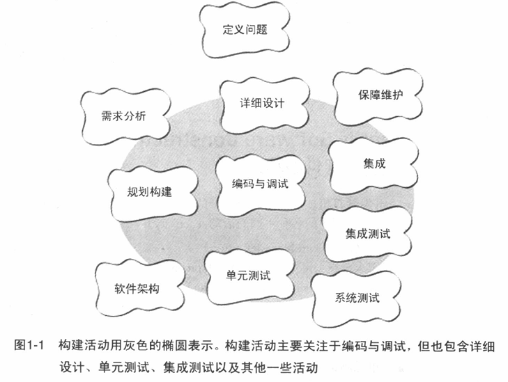
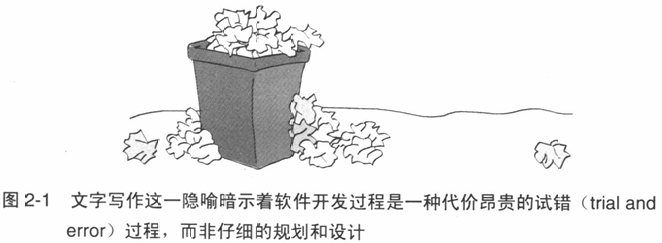
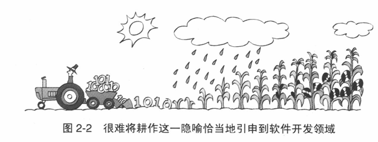
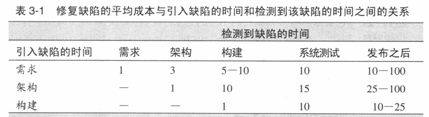
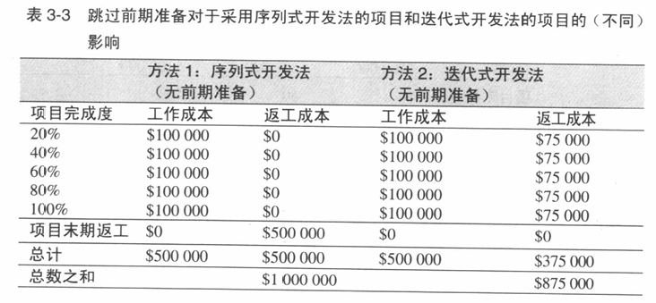
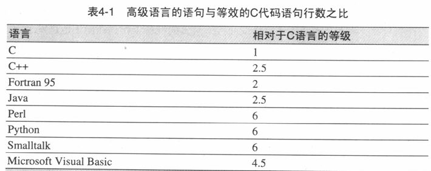

---
# You can also start simply with 'default'
theme: default
# some information about your slides (markdown enabled)
title: 《代码大全2》第1-9章读书分享
info: |
  ## Slidev Starter Template
  Presentation slides for developers.

  Learn more at [Sli.dev](https://sli.dev)
# apply unocss classes to the current slide
class: text-center
# https://sli.dev/features/drawing
drawings:
  persist: false
# slide transition: https://sli.dev/guide/animations.html#slide-transitions
transition: slide-left
# enable MDC Syntax: https://sli.dev/features/mdc
mdc: true
# open graph
# seoMeta:
#  ogImage: https://cover.sli.dev
---

# 《代码大全2》第1-9章读书分享

分享人：林灏均

  Press Space for next page <carbon:arrow-right />

---
transition: fade-out
---

# 目录

- 📝 **欢迎进入软件构建的世界** - 软件构建的概念
- 🎨 **用隐喻来更充分地理解软件开发** - 什么是软件开发
- 🧑‍💻 **三思而后行：前期准备** - 问题定义、需求以及架构
- 🤹 **关键的“构建”决策** - 编程约定以及最佳实践
- 🎥 **软件构建中的设计** - 管理复杂度
- 📤 **可以工作的类** - 如何创建高质量的类
- 🛠 **高质量的子程序** - 提高程序可管理性
- 🤝 **防御式编程** - 保护程序免遭非法输入数据的破坏
- 💻 **伪代码编程过程** - 减少设计和编写文档工作量

---
transition: slide-up
level: 2
---

# 第一章：欢迎进入软件构建的世界

## 什么是软件构建
软件构建是指将需求转化为可运行软件的全过程，主要包含编码与调试，但也涉及详细设计、测试、集成等其他活动，强调从抽象到具体的工程化落地。

可以认为“构建” = “编码”或“编程”

---
transition: slide-up
level: 2
---

## 软件构建为何如此重要
- 成本占比最高：根据项目规模的不同，构建活动在整个软件开发活动总时间中所占的比例一般在30%至80%之间。优化构建效率可显著降低项目总成本。
- 质量决定性环节：构建质量直接关联软件缺陷率，规范的变量命名、模块化设计能降低后期维护难度，如减少全局变量使用可避免不可预见的副作用。
- 技术债主要来源：草率的构建决策（如硬编码、缺乏单元测试）会积累技术债务，重构代价随时间指数增长。
- 构建活动是唯一确保会完成的工作：现实中不那么完美的软件项目，往往跳过需求和设计的阶段而直接跃入构建环节。之后又由于有太多的错误要修正而时间又不够，测试环节也被抛到一边了。但是，无论一个项目的计划有多匆忙、多糟糕，它都不可能扔下构建活动——这是不可或缺的环节。因此，对构建活动进行改进，是改进软件开发过程的一种有效途径。

---
level: 2
---

# 第二章：用隐喻来更充分地理解软件开发

## 隐喻的重要性
- 通过不太理解的东西与较为熟悉的东西比较，可以对不太理解的东西产生更深刻的理解。
- 科学史中存在许多借助隐喻产生的新发现：苯环、气体分子运动理论、光的波动理论等。
- 生动性：隐隐暗示着各种属性、关系与需要补充查证的部分。

## 如何使用软件隐喻
软件隐喻更像是启发方法，而不是算法，没有一套能解决所有问题的指导规则。

- 使用软件隐喻提高编程问题和过程的洞察力
- 想象出更好的做事情的方法
- 善于使用隐喻的人对编程的理解更好，并且能更快地写出更好的代码

---
class: px-20
---

## 书中的软件隐喻

### 写作(writing)代码
开发一个程序就像写一封有缘由的信，从头写到尾就完了，想到什么就写什么。

对于小型项目来说这种隐喻是足够的，但是对大部分项目来说，这种隐喻忽略了开发的复杂性。

### 培植系统
创造软件类似于播种和耕作，每天小步前进，一点点添加到系统中。

“每次做一点”这种增量开发与耕作类似，但总体而言这个隐喻不够贴切，暗示了人们无法对开发软件的过程进行直接控制。

---

## 书中的软件隐喻

### 建造(building)软件
建造软件这一隐喻说明了软件开发会有许多阶段，比如计划，准备，执行等，根据所建软件的规模，各个阶段的种类与程度会发生变化（如建造一个狗屋与帝国大厦）。

这个隐喻将软件开发比作建造建筑物的过程，强调软件构建需要像建筑工程一样具备系统性、规范性和专业性。

### 建筑隐喻的优势：

1. 强调计划性
- 预先设计：避免"边写边想"的随意性
- 风险控制：提前识别和规避技术风险
- 资源规划：合理安排人员和时间资源
2. 重视质量
- 标准化流程：建立规范的开发流程
- 质量检查点：在关键节点进行质量把控
- 长期维护：考虑软件的全生命周期成本

3. 团队协作
- 角色分工：明确各角色的职责和协作关系
- 沟通机制：建立有效的团队沟通渠道
- 文档管理：维护完整的设计和实现文档

---

# 第三章：三思而后行：前期准备

## 前期准备的重要性
食物链隐喻：程序员是软件食物链的最后一环。架构师吃掉需求，设计师吃掉架构，而程序员则消化设计。

一般而言：发现错误的时间要尽可能接近引入该错误的时间。缺陷在软件食物链里面呆的时间越长，它对食物链的后级造成损害就越严重。由于需求是首先要完成的事情，需求的缺陷就有可能在系统中潜伏更长的时间，代价也更加昂贵。在软件开发过程的上游引入的缺陷通常比那些在下游引入的缺陷具有更广泛的影响力。这也使得早期的缺陷代价更加高昂。

---
level: 2
---

## 迭代式开发 vs. 序列式开发
迭代式开发中，需求发掘、构建、设计等工作较为重合，伴随整个编码过程，检错修正的成本在过程中逐次交付。序列式开发中，各工作较为独立，每一个工作依赖于前一轮工作。

对两种开发方式，均需要做前期准备，可以大大降低成本。

对于需求稳定、设计理解透彻、开发者熟悉相关领域、项目风险小、需要长期可预测性、后期更改代码消耗很大的项目，推荐采用序列式开发。反之，推荐迭代式开发。

---
level: 2
---

## 问题定义、需求与架构
### 问题定义
在开始构建之前，首先要满足的一项先决条件是，对这个系统要解决的问题做出清楚的陈述，这有时称为“产品设想”或者“产品定义”。

“问题定义”只定义了“问题是什么”，而不涉及任何可能的解决方案。应该使用客户的语言书写，而不是专业的计算机术语。

如果没有一个良好的问题定义，你努力解决的可能是一个错误的问题。

---

## 问题定义、需求与架构
### 需求
“需求”详细描述软件系统应该做什么，这是达成解决方案的第一步。“需求活动”也称为“需求开发”、“需求分析”、“需求定义”等。

正式需求的优势：
- 确保用户（而不是程序员）驾驭系统的功能
- 避免争论
- 减少开发后的系统变更

### 需求变更有时是不可避免的
“一旦客户接受了一份需求文档，就再也不做更改”是一个美好的愿望。然而对一个典型的项目来说，在编写代码之前，客户无法可靠地描述他们想要的是什么。就如同做这个项目的时间越长，对这个项目的理解也就越深入一样，客户参与项目的时间越长，他们对项目的理解也就越深入。开发过程能够帮助客户更好地理解自己的需求，这是需求变更的主要来源。计划严格依照需求行事，实际上就是计划不对客户的要求做出回应。

---

## 问题定义、需求与架构
### 架构
软件架构是软件设计的高层部分，是用于支撑更细节的设计的框架，也称为“系统架构”、“高层设计”或“顶层设计”。通常会用一份独立的文档描述架构，这份文档称为“架构规格书”或者“顶层设计”

### 架构的典型组成
- 程序组织：各构造块的分工与合作；
- 主要的类；
- 数据设计；
- 业务规则；
- UI；资源管理；安全性；性能；可伸缩性；互用性；国际化/本地化；IO；错误处理等

好的架构设计应该与待解决的问题和谐一致。在查看架构的时候，你应该很愉快，因为它给出的解决方案看上去既自然又容易。而不应该看起来像是用胶带把架构和待解决的问题硬捆到一起。

---
transition: slide-up
level: 2
---

# 第四章：关键的“构建”决策

## 选择编程语言
熟悉的语言比不熟悉的语言生产力高；高级语言（java, c++, python, perl…）比低级语言生产力高。

程序员同样受到所用编程语言的影响。在一种编程语言中可用来表达编程思想的词汇，毫无疑问地决定了你将如何表达你的思想，甚至可能决定了你能表达什么样的思想。

---
level: 2
---

## 编程约定
在高质量软件中，你可以看到“架构的概念完整性”与“其底层实现”之间的关系。“实现”必须与“架构”保持一致，并且这种一致性是内在的、固有的。这正是变量名称、类的名称、子程序名称、格式约定、注释约定等这些针对“构建活动”的指导方针的关键所在。

## 选择主要的构建方法
### 构建 checkList

1. 编码
- 多少设计工作需要预先进行
- 名称、注释、代码格式等约定
- 如何处理错误条件
2. 团队工作
- 结对编程 or 独自编程
- 提交与分支规范

3. 质量保证
- 单元测试
- 调试方法
- 代码 review
4. 工具
- 编程工具
- 开发语言
- 编译器、语法检查器等

---
level: 2
---

# 第五章：软件构建中的设计

## 设计的限制
- 设计是一个“险恶”的问题：只有通过解决或至少部分解决，才能明确地定义它。
- 设计中会有很多错误和修正的过程。
- 设计有诸多限制，要针对限制与需求进行取舍。
- 设计是不确定的，是启发式的过程，是自然而然的。

## 关键（理想）的设计理念
复杂度最小；易于维护；松散耦合；可拓展；可复用；高扇入（大量的类使用特定的类）；低扇出（一个类中少量使用其他的类）等

## 管理复杂度的重要性
在对导致软件项目失败的原因进行调查时，人们很少把技术原因归为项目失败的首要因素。项目的失败大多数都是由差强人意的需求、规划和管理所导致的。但是，当项目确由技术因素导致失败时，其原因通常就是失控的复杂度。有关的软件变得极端复杂，让人无法知道它究竟是做什么的。当没人知道对一处代码的改动会对其他代码带来什么影响时，项目也就快停止进展了。

---

## 设计层次与实践
1. 系统层次
2. 分解为子系统或包：识别出所有的主要子系统（如业务规则、用户界面、数据库访问等），对子系统之间的交互关系要加以限制到最简，一个常用原则是应该无环。
3. 分解为类：识别出每个子系统中所有的类
4. 分解为子程序：细化类内部的私用子程序
5. 子程序内部设计：为每个子程序布置详细的功能

## 设计的启发式方法

- 找出现实世界中的对象
- 形成一致的抽象
- 封装实现细节
- 当继承能简化设计时就继承

- 信息隐藏
- 找出容易改变的区域
- 松散耦合
- 查阅常用的设计模式

---

# 第六章：可以工作的类

## ADT：描述类的数据与操作
抽象数据类型(ADT)是指一些数据以及对这些数据所进行的操作的集合。这些操作既向程序的其余部分描述了这些数据是怎么样的，也允许程序的其余部分改变这些数据。

“抽象数据类型”概念中“数据”一词的用法有些随意。一个ADT可能是一个图形窗体以及所有能影响该窗体的操作;也可以是一个文件以及对这个文件进行的操作;或者是一张保险费率表以及相关操作等。

## ADT 的优势
- 可以隐藏实现细节与内部数据；
- 可以降低耦合，改变一部分时不用改变所有代码；
- 可以避免直接操作数据可能带来的粗心错误；
- 接口可以传递更多信息；
- 程序更具自我说明性，更可读，且可以像操作现实中的数据一样操作。

---

## ADT 与类的区别
抽象数据类型构成了“类/class”这一概念的基础。在支持类的编程语言里，你可以把每个抽象数据类型用它自己的类实现。类还涉及到继承和多态这两个额外的概念。因此，考虑类的一种方式，就是把它看做是抽象数据类型再加上继承和多态两个概念。

## 良好的接口抽象
- 应该展现一致的抽象层次，一个类及其接口对应一个ADT；
- 要清楚抽象的对象；
- 要检查是否需要提供成对的服务，如class Light可能要提供开灯与关灯的服务；
- 假如类中有两个甚至多个不相干的独立部分，将它们拆开；
- 尽可能使接口可编程，即通过参数、调用关系决定它们的关系，而减少“执行a接口之前必须执行b接口”这样的软关系；
- 不要在修改类的设计时破坏类的抽象；
- 同时考虑抽象性与内聚性。

---

## 良好的封装
- 尽可能在不破坏抽象完整性的前提下限制内部成员与方法的可访问性；
- 尽量不要暴露内部数据，尤其是那些相关联的数据；
- 不要暴露类的内部实现；
- 不要对使用者进行假设。假如某个方法有什么前提，应该自己设定或检查；
- 不要因为一个方法只调用了公共方法就将其定义为公开接口，而应该从抽象角度考虑是否公开；

## 设计与实现
- “has a”：尽量用包含实现，万不得已时用继承实现；
- 警惕包含有7个数据成员以上的类
- 继承可能很危险，所以要对继承仔细说明；
- 把公用的接口、数据及操作尽可能放到基类；
- 禁止隐式地调用不该调用的方法，如赋值、构造函数；
- 减少类调用的不同子程序地数量；对其他类子程序尽量少调用；总的来说，尽量减少类和其他类地合作关系。
- 构造函数尽可能给所有数据初始化；

---

# 第七章：高质量的子程序

## 创建子程序的理由
- 降低复杂度；
- 引入中间的、易懂的抽象；
- 避免代码重复；
- 隐藏代码执行顺序；
- 隐藏危险操作，如指针操作；
- 提高可移植性；

不要因为操作过于简单而不愿意将其写作子程序。简单的操作写成程序可以增加代码可读性，且便于后续修改、增加该操作。

---

# 第七章：高质量的子程序

## 高质量子程序的最佳实践
- 功能内聚性：让一个子程序完成且仅完成一个操作
- 子程序名字：
1. 描述子程序的功能
2. 避免含糊不清的动词（HandleCalculation, ProcessInput…）。
3. 要能对返回值进行描述。
4. 准确使用对仗词语，如open/close, increment/decrement…，可以增强可读性。
5. 在一个项目中为常用操作确立命名规则。
- 子程序参数：
1. 如果几个子程序用了相似的参数，应使它们保持顺序一致。
2. 不要将输入变量用作工作变量。
3. 把子程序参数限定于三个以内。
4. 为子程序传递仅足以维持其抽象的参数。

---
level: 2
---

# 第八章：防御式编程

## 防御非法输入
- 检查所有来源于外部的值；
- 检查函数的参数；
- 决定如何处理错误的输入数据；

## 断言assertion
- 检查输入参数
- 检查指针是否非空
- 检查容器的大小、是否空或满

断言常用于开发阶段，产品代码中常常不进行编译。
断言与错误处理：用错误处理处理错误的情况，用断言处理绝不应发生的情况。
不要将应该执行的功能代码放入断言。

 

> 对于错误情况的可能处理：

>> 返回中立值；换用下一个正确数据；返回和上次相同的数据；换用最接近的合法值。这些方法适用于一般的项目，健壮性的要求高于正确性的要求。

>> 把错误信息写入日志后继续执行。可以与其他操作结合。

>> 返回错误码。

>> 调用错误处理函数或对象。这样耦合度太高，而且如果发生了错误的内存溢出、覆盖了这一程序的地址或数据，会无法正确调用。

>> 显示出错信息。

>> 在局部处理错误。这样留有很大灵活度，但整体健壮性得不到保证。

>> 关闭程序。常用于关乎生命安全的程序。

> 错误处理方式应该尽量一致。

 

> 异常机制

>> 仅用于真正的、不可忽略的、无法自行解决的异常。考虑异常的替代方案，是不是非得使用异常不可。

>> 不要用异常推卸责任。

>> 避免在构造函数、析构函数中抛出异常以免内存泄漏。

>> 在恰当的抽象层次抛出异常，不要在抛出异常时泄露实现机制。

>> 在异常信息中加入导致异常的全部信息。

>> 不要catch异常之后不进行处理。

>> 要了解函数库可能抛出的异常。

>> 可以采取集中的异常处理机制，尤其是打印日志一类常规的处理机制。

>> 使用同一、标准的异常类。

 

> 隔离错误：将错误隔离开来，如在公用方法中假设输入参数不可靠并进行处理。其他部分，如私有方法，可以假设数据无误。

方便编写代码；方便出错时检查错误来源于输入数据还是程序内部错误。

 

> 调试代码：用于在程序内部检查运行状态以及是否有错。

开发阶段对性能要求不高，不用吝惜资源。应该尽早采用调试代码。

> 进攻式编程：开发阶段将错误尽可能暴露出来，产品中尽可能自我修复错误。

  可取方式：

>> 采用断言。

>> 完全填充分配到的内存以检测内存分配错误。

>> 完全填充文件或流以检测格式错误。

>> 假如switch语句中的default，或if-else结构中最后的else不应被达到(access)，应该在那里打印警告语句甚至抛出异常，使得错误不会被忽视。

>> 删除对象前填充垃圾数据。

> 在商用版本中：不要移除检查重要错误的代码。移除检查微小错误，或者会让程序硬性崩溃的代码。保留可以让程序稳妥地崩溃的代码。为技术人员保留错误信息，并确定该信息是友好的。

可以用make或宏定义处理，或编写自己的预处理脚本。

 

> 不要过度使用防御式编程、使代码臃肿不堪。要在小错误的修改成本和臃肿的代码、复杂的编写带来的成本之间权衡。

## 断言assertion

## 错误处理

## 异常机制

## 不要过度使用防御式编程

---
level: 2
---

# 第九章：伪代码编程过程

## 创建类的步骤

## 创建子程序的步骤

---

## 伪代码及其优点

## 设计子程序的过程

## 伪代码编程过程的替代方案

