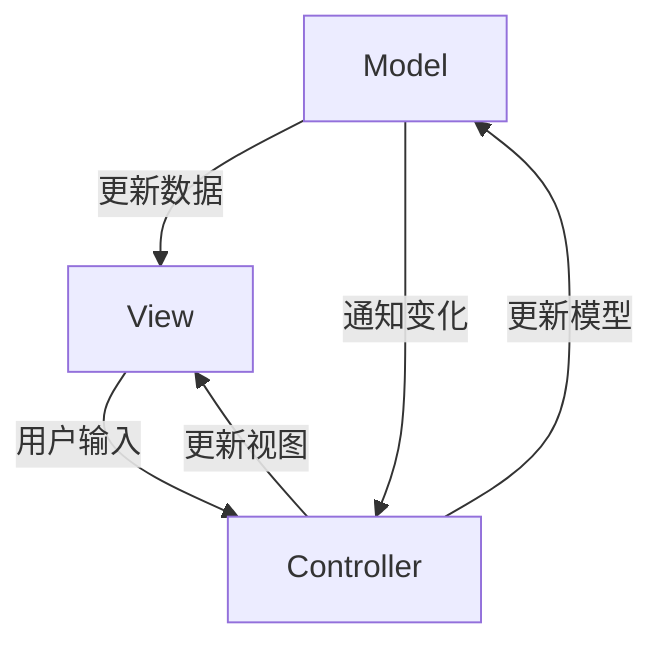

# Head First 设计模式读书笔记

## 第八章：模板方法模式

### 定义
在一个方法中定义一个算法的骨架，而将一些步骤延迟到子类中。模板方法使得子类可以在不改变算法结构的情况下，重新定义算法中的某些步骤。

### 优点
- 模板方法类主导一切，它拥有算法，而且保护这个算法
- 将代码的复用最大化
- 算法只存在与一个地方，易于修改
- 提供了算法框架，子类只需要实现细节算法即可
- 模板方法类专注算法本身，子类专注算法实现

### 模板方法中的钩子
在定义模板方法的时候，可能会在算法骨架中添加一个方法，这个方法只有空的实现或者默认实现，子类可以自行选择是否覆盖。这个方法就叫做 **钩子**。

### 目的
- 可以让子类选择性实现算法中的可选部分
- 让子类有机会对模板方法中即将发生的动作做出反应

### 好莱坞原则
> 高层组件对低层组件说：别调用我们，我们会调用你。

遵循这个原则可以防止“依赖腐败”，也就是高层组件依赖低层组件，而低层组件又依赖高层组件。这种依赖关系，会增加系统复杂性。

所以在这个原则下，所有低层组件都挂靠在高层组件上，但是使用它们的时机由高层决定。

### JS 中的模板方法模式

#### sort 方法

sort 方法可以接受一个比较函数，允许用户定义具体的排序逻辑，而不必改变排序算法的核心结构。

```js
const numbers = [5, 3, 8, 1];
numbers.sort((a, b) => a - b); // 用户自定义比较逻辑
```

#### EventTarget 和事件处理

在事件处理机制中，addEventListener 方法允许用户定义响应事件的具体行为，而事件的分发和处理流程则由浏览器管理。

```js
const button = document.querySelector('button');
button.addEventListener('click', () => {
    console.log('Button clicked!');
});
```

## 第九章：迭代器与组合模式

### 迭代器模式

#### 定义

> 提供了一种方法顺序访问一个集合对象中的各个元素，而又不暴露其内部的表示。

#### Js 中的自定义迭代器
ES6 后 Js 可以创建自定义对象并实现迭代器接口。实现此接口需要定义一个 next 方法，该方法需返回一个对象，包含 value 和 done 属性。

```js
class MyIterator {
    constructor(data) {
        this.data = data;
        this.index = 0;
    }

    next() {
        if (this.index < this.data.length) {
            return { value: this.data[this.index++], done: false };
        } else {
            return { done: true };
        }
    }
}

// 使用自定义迭代器
const myData = [10, 20, 30];
const iterator = new MyIterator(myData);

let result = iterator.next();
while (!result.done) {
    console.log(result.value); // 输出 10, 20, 30
    result = iterator.next();
}
```

#### 局限性

- 当面对树形结构的遍历时，迭代器力有不逮
- 遍历的灵活度较低

### 组合模式

#### 定义

> 允许你将对象组合成树形结构来表现“整体/部分”层次结构。组合能让客户以一致的方式处理个别对象以及对象组合。

> 可用于构建复杂的树形结构

#### 示例

```js
// 组件接口
class FileSystemComponent {
    constructor(name) {
        this.name = name;
    }

    display() {
        throw new Error("This method should be overridden!");
    }
}

// 文件类
class File extends FileSystemComponent {
    display() {
        console.log(`File: ${this.name}`);
    }
}

// 文件夹类
class Folder extends FileSystemComponent {
    constructor(name) {
        super(name);
        this.children = [];
    }

    add(component) {
        this.children.push(component);
    }

    remove(component) {
        const index = this.children.indexOf(component);
        if (index > -1) {
            this.children.splice(index, 1);
        }
    }

    display() {
        console.log(`Folder: ${this.name}`);
        this.children.forEach(child => child.display());
    }
}

// 使用组合模式
const root = new Folder("Root");
const folderA = new Folder("Folder A");
const folderB = new Folder("Folder B");

const file1 = new File("File 1.txt");
const file2 = new File("File 2.txt");
const file3 = new File("File 3.txt");

folderA.add(file1);
folderA.add(file2);
folderB.add(file3);
root.add(folderA);
root.add(folderB);

// 展示文件系统
root.display();
```

## 第十章：状态模式

### 定义

> 允许对象在内部状态改变时改变它的行为，对象看起来好像修改了它的类。

### 核心概念

- Context（上下文）：持有一个状态对象的引用，负责在不同状态之间切换。
- State（状态）：定义一个接口以封装与特定状态相关的行为。
- ConcreteState（具体状态）：实现状态接口，定义在该状态下的具体行为。

### 优点

- **清晰的状态管理**：将不同状态的行为封装在各自的类中，使得代码更加清晰和可维护。
- **易于扩展**：可以很容易地添加新的状态，而不需要修改现有的状态或上下文代码。
- **减少条件语句**：通过将状态相关的行为分散到各个状态类中，可以有效减少复杂的条件语句。

### 示例

```js
// 状态接口
class LightState {
    turnOn(light) {
        throw new Error("This method should be overridden!");
    }

    turnOff(light) {
        throw new Error("This method should be overridden!");
    }
}

// 具体状态：开
class OnState extends LightState {
    turnOff(light) {
        console.log("Turning off the light.");
        light.setState(new OffState());
    }
}

// 具体状态：关
class OffState extends LightState {
    turnOn(light) {
        console.log("Turning on the light.");
        light.setState(new OnState());
    }
}

// 上下文：电灯
class Light {
    constructor() {
        this.state = new OffState(); // 初始状态为关
    }

    setState(state) {
        this.state = state;
    }

    turnOn() {
        this.state.turnOn(this);
    }

    turnOff() {
        this.state.turnOff(this);
    }
}

// 使用状态模式
const light = new Light();
light.turnOn();  // 输出: Turning on the light.
light.turnOff(); // 输出: Turning off the light.
```

### 与策略模式的区别

- **状态模式**：用于在对象的内部状态改变时改变其行为。状态模式关注的是对象的状态变化，允许对象在不同状态下表现出不同的行为。
- **策略模式**：用于在多个算法之间选择。策略模式允许客户端选择不同的算法，而不需要改变使用算法的上下文。策略模式关注的是如何选择合适的算法。

## 第十一章：代理模式

### 定义

> 为另一个对象提供一个替身或占位符以控制对这个对象的访问。

### 核心概念

- **主题接口（Subject）**：代理和真实对象都实现这个接口。
- **真实对象（RealSubject）**：真正的对象，执行实际的操作。
- **代理（Proxy）**：持有真实对象的引用，控制对真实对象的访问，可能会在访问前后添加额外的逻辑。

### 优点

- **控制访问**：可以在代理中添加权限控制、访问限制等。
- **延迟加载**：在需要时才创建真实对象，节省资源。
- **增强功能**：在调用真实对象的前后添加额外的功能，如日志、事务等。

### Js 中的 proxy api

```js
// 真实对象
const target = {
    name: "Alice",
    age: 25
};

// 主题接口
const handler = {
    get(target, prop, receiver) {
        console.log(`Getting ${prop}`);
        return Reflect.get(target, prop, receiver);
    },
    set(target, prop, value, receiver) {
        console.log(`Setting ${prop} to ${value}`);
        return Reflect.set(target, prop, value, receiver);
    }
};

// 代理
const proxy = new Proxy(target, handler);

// 使用代理
console.log(proxy.name); // 输出: Getting name \n Alice
proxy.age = 30;          // 输出: Setting age to 30
console.log(proxy.age);  // 输出: Getting age \n 30
```

## 第十二章：复合模式

### 定义

> 将多个模式结合起来形成一个“框架”，以解决一般性问题。

> 在形式上，复合模式是多个模式的组合，但满足了这一条并不一定是复合模式。

### MVC 模式

MVC（Model-View-Control） 是一个经典的复合模式。

- **视图**：用来呈现模型，视图通常直接从模型中取得它需要显示的状态和数据。
- **控制器**：取得用户输入并解读其对模型的操作。
- **模型**：模型持有所有的数据、状态和程序逻辑。



#### 简要流程

- 用户和视图交互
- 控制器要求模型改变状态
- 控制器也可能要求视图做出改变
- 当模型状态改变时，模型会通知视图
- 视图向模型询问状态

#### 涉及的模式

- **策略模式**：视图是一个对象，可以使用不同的策略，而控制器提供策略。
- **观察者模式**：当模型改变时，视图和控制器都会得到通知。
- **组合模式**：视图是一堆小组件的组合。

## 第十三章：真实世界中的模式

### 设计模式非万灵丹
设计模式不是解决所有问题的神奇药方。它们是经过验证的解决方案，但必须在上下文中应用。
过度使用模式（Over-Engineering）会导致代码复杂化。例如，如果一个简单类就能解决问题，就不要强行套用工厂模式或抽象工厂模式。
建议：先识别问题，再选择合适的模式。记住“简单就是美”（Keep It Simple, Stupid - KISS 原则）。

### 反模式
反模式是常见的错误实践，会导致问题而不是解决问题。
示例：
- 大泥球（Big Ball of Mud）：代码缺乏结构，到处是临时修复，导致维护噩梦。
- 意大利面条代码（Spaghetti Code）：代码纠缠不清，难以理解和修改。
- 金锤子（Golden Hammer）：过度使用某个熟悉的模式，而忽略其他更好选择（例如，总用单例模式）。
建议：识别反模式，并用设计模式来重构代码。反模式提醒我们，模式的使用需要智慧。

### 设计原则
1. 封装变化（Encapsulate what varies）。
2. 针对接口编程，而不是针对实现编程（Program to an interface, not an implementation）。
3. 多用组合，少用继承（Favor composition over inheritance）。
4. 为了交互对象之间的松耦合设计而努力（Strive for loosely coupled designs between objects that interact）。
5. 类应该对扩展开放，对修改关闭（Classes should be open for extension but closed for modification）——开闭原则（OCP）。
6. 依赖倒置原则（Depend on abstractions. Do not depend on concrete classes）。
7. 最少知识原则（Principle of least knowledge）——只和你的密友谈话（Talk only to your immediate friends）。
8. 好莱坞原则（The Hollywood Principle）——别调用我们，我们会调用你（Don't call us, we'll call you）。
9. 一个类应该只有一个改变的原因（A class should have only one reason to change）——单一责任原则（SRP）。
10. 里氏替换原则（Liskov Substitution Principle）：子类必须能够替换其超类。

## 附录：剩下的模式

### 桥接模式（Bridge Pattern）
定义：桥接模式是一种结构性设计模式，用于将抽象与实现分离，使得二者可以独立变化。

应用场景：当你需要在多个抽象类和实现类之间进行组合时，使用桥接模式可以避免类爆炸。

示例：图形绘制系统中，抽象的形状类（如圆形、矩形）可以通过具体的绘图实现（如使用不同的图形库）进行桥接。

### 生成器模式（Builder Pattern）
定义：生成器模式是一种创建性设计模式，用于构建复杂对象的分步骤构建过程，允许使用相同的构建过程创建不同的表示。

应用场景：当一个对象的构建过程需要多个步骤，且不同对象的构建过程相似时，使用生成器模式可以提高可读性和可维护性。

示例：构建复杂的餐点（如汉堡）时，可以通过生成器模式定义不同的构建步骤（添加食材、选择饮品等）。

### 责任链模式（Chain of Responsibility Pattern）
定义：责任链模式是一种行为设计模式，旨在将请求的发送者与接收者解耦，形成一条责任链来处理请求。

应用场景：当多个对象可以处理同一请求，且你希望将请求的发送者和接收者解耦时，使用责任链模式可以实现灵活的请求处理。

示例：事件处理系统中，不同的事件处理器可以组成责任链，逐级处理用户输入事件。

### 蝇量模式（Flyweight Pattern）
定义：蝇量模式是一种结构性设计模式，旨在通过共享对象来减少内存使用。

应用场景：当你需要大量相似对象且这些对象占用大量内存时，使用蝇量模式可以显著减少内存占用。

示例：文本编辑器中的字符对象可以使用蝇量模式，通过共享同一字符对象来减少内存占用。

### 解释器模式（Interpreter Pattern）
定义：解释器模式是一种行为设计模式，定义了一个语言的文法，并提供一个解释器来解释该语言中的句子。

应用场景：当你需要定义一种语言的语法，并在此基础上解析和执行指令时，可以使用解释器模式。

示例：简单计算器的表达式解析器，可以通过解释器模式来解析和计算数学表达式。

### 中介者模式（Mediator Pattern）
定义：中介者模式是一种行为设计模式，用于定义一个中介对象，以促进对象之间的通信从而减少直接耦合。

应用场景：当多个对象需要相互通信，但又不希望彼此之间直接依赖时，使用中介者模式可以简化通信。

示例：在聊天系统中，中介者对象可以负责消息的转发，简化用户之间的直接交互。

### 备忘录模式（Memento Pattern）
定义：备忘录模式是一种行为设计模式，允许在不违反封装性的前提下，捕获对象的内部状态并在需要时恢复。

应用场景：当需要实现撤销操作或保存对象状态时，使用备忘录模式可以方便地管理状态。

示例：文本编辑器可以使用备忘录模式来保存和恢复用户的输入状态。

### 原型模式（Prototype Pattern）
定义：原型模式是一种创建性设计模式，通过复制现有对象来创建新对象，而不是通过构造函数。

应用场景：当对象的创建成本较高时，可以使用原型模式来提高性能。

示例：使用原型模式克隆图形对象（如圆形、矩形）来创建新的图形，而不是重新实例化。

### 访问者模式（Visitor Pattern）
定义：访问者模式是一种行为设计模式，允许你添加新操作而不改变对象结构，利用访问者对象来访问不同类型的元素。

应用场景：当需要对一组对象执行多种操作且不想修改对象本身时，可以使用访问者模式。

示例：在一个图形处理系统中，访问者可以用于执行不同的操作（如绘制、打印）而无需修改图形对象的结构。
