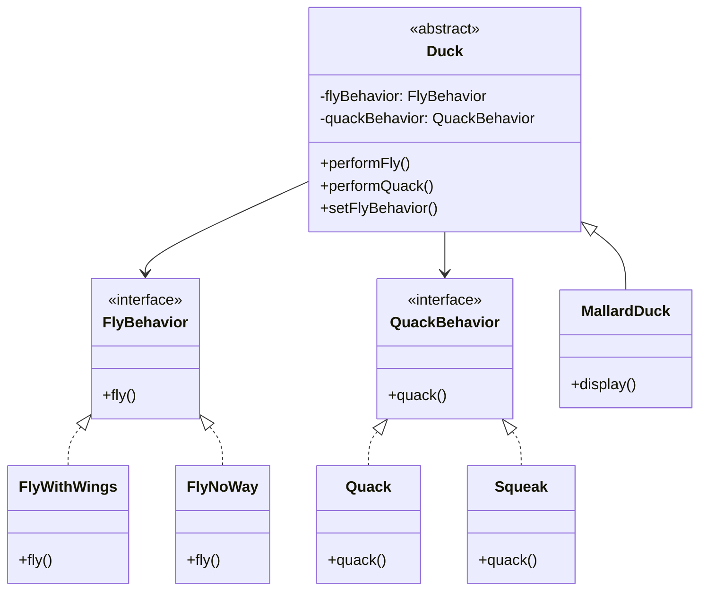
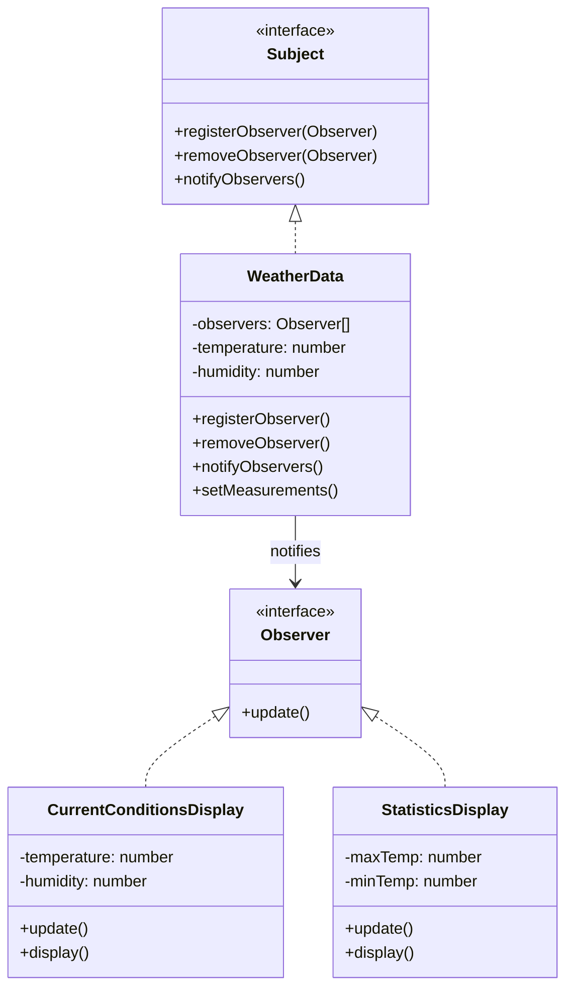
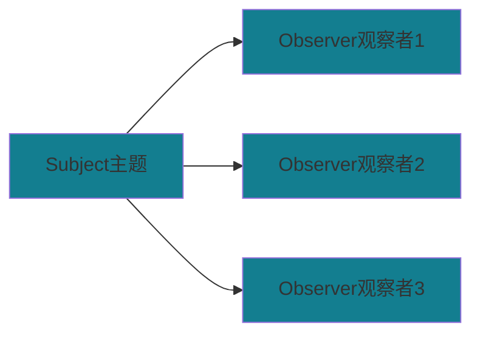
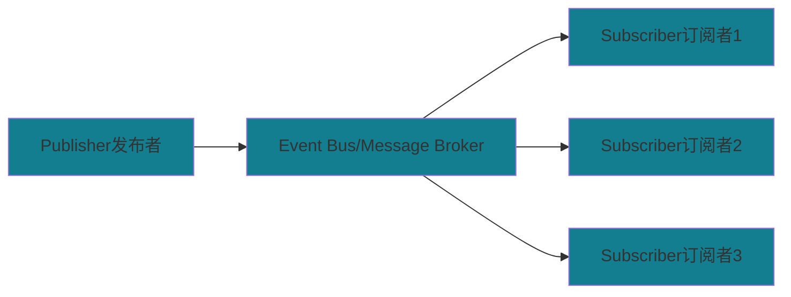
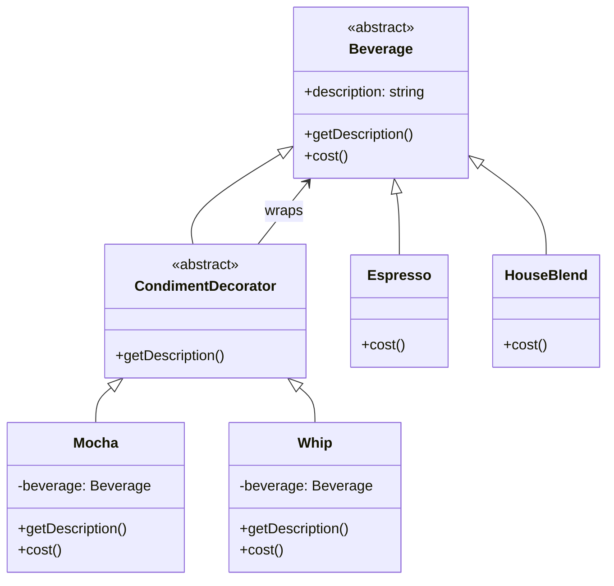
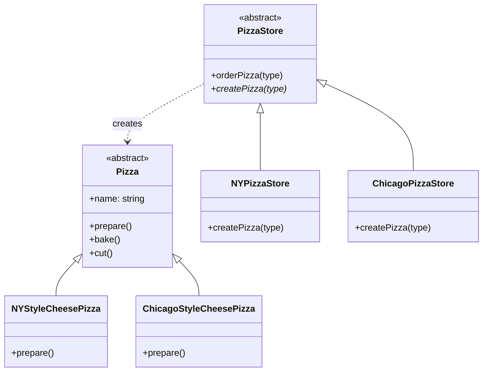
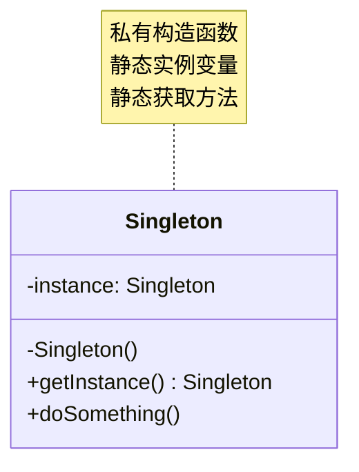
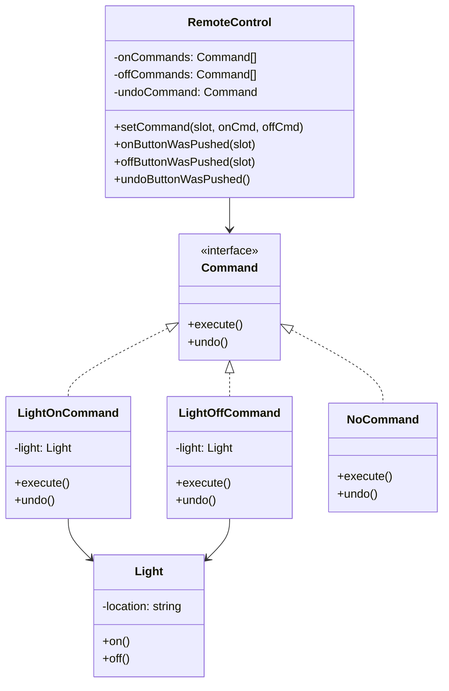
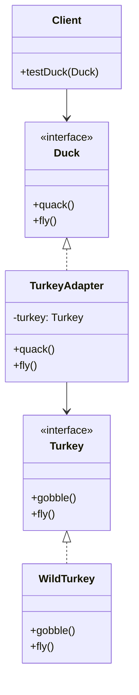
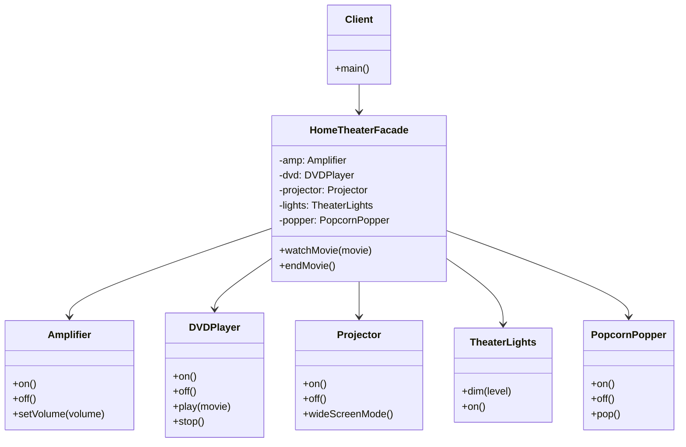

# 读书笔记：Head First 设计模式

## 第1章 策略模式 (Strategy Pattern)

### 核心思想
定义算法族，分别封装起来，让它们之间可以互相替换。策略模式让算法的变化独立于使用算法的客户。

### 设计原则
1. **找出应用中可能需要变化之处，把它们独立出来**
2. **针对接口编程，而不是针对实现编程**
3. **多用组合，少用继承**

### 经典案例：鸭子模拟器
**问题：** 不同种类的鸭子有不同的飞行和叫声行为，使用继承会导致代码重复和维护困难。

**解决方案：** 将飞行行为和叫声行为抽象成接口，具体行为作为实现类。



### TypeScript 核心实现

```typescript
// 策略接口
interface FlyBehavior {
  fly(): void;
}

// 具体策略
class FlyWithWings implements FlyBehavior {
  fly(): void { console.log("I'm flying!"); }
}

class FlyNoWay implements FlyBehavior {
  fly(): void { console.log("I can't fly"); }
}

// 上下文类
abstract class Duck {
  protected flyBehavior: FlyBehavior;

  constructor(flyBehavior: FlyBehavior) {
    this.flyBehavior = flyBehavior;
  }

  performFly(): void {
    this.flyBehavior.fly();
  }

  // 运行时改变行为
  setFlyBehavior(flyBehavior: FlyBehavior): void {
    this.flyBehavior = flyBehavior;
  }
}

// 具体鸭子
class MallardDuck extends Duck {
  constructor() {
    super(new FlyWithWings());
  }
}
```

### 应用场景
- 支付系统（支付宝、微信、银行卡支付）
- 排序算法选择
- 游戏角色技能系统
- 数据压缩算法选择

---

## 第2章 观察者模式 (Observer Pattern)

### 核心思想
定义对象之间的一对多依赖，当一个对象改变状态时，它的所有依赖者都会收到通知并自动更新。

### 设计原则
**为了交互对象之间的松耦合设计而努力**

### 经典案例：气象监测站
**问题：** 气象数据更新时，需要同时更新多个显示设备。



### TypeScript 核心实现

```typescript
// 观察者接口
interface Observer {
  update(data: any): void;
}

// 主题接口
interface Subject {
  registerObserver(observer: Observer): void;
  removeObserver(observer: Observer): void;
  notifyObservers(): void;
}

// 具体主题
class WeatherData implements Subject {
  private observers: Observer[] = [];
  private temperature: number = 0;

  registerObserver(observer: Observer): void {
    this.observers.push(observer);
  }

  removeObserver(observer: Observer): void {
    const index = this.observers.indexOf(observer);
    if (index >= 0) this.observers.splice(index, 1);
  }

  notifyObservers(): void {
    this.observers.forEach(observer => 
      observer.update({ temperature: this.temperature })
    );
  }

  setMeasurements(temperature: number): void {
    this.temperature = temperature;
    this.notifyObservers();
  }
}

// 具体观察者
class CurrentConditionsDisplay implements Observer {
  update(data: any): void {
    console.log(`Current temperature: ${data.temperature}°F`);
  }
}
```

### 推模型 vs 拉模型
- **推模型：** 主题向观察者推送详细信息
- **拉模型：** 主题只通知变化，观察者主动获取需要的数据

### 观察者模式 vs 发布订阅模式

虽然观察者模式和发布订阅模式都实现了对象间的一对多依赖关系，但它们有重要区别：

#### 观察者模式 (Observer Pattern)


**特点：**
- **直接依赖：** Subject 直接持有 Observer 的引用
- **紧耦合：** Subject 和 Observer 相互知道对方的存在
- **同步通信：** 通常是同步调用
- **一对多：** 一个 Subject 对应多个 Observer

#### 发布订阅模式 (Publish-Subscribe Pattern)


**特点：**
- **间接依赖：** Publisher 和 Subscriber 通过消息中心通信
- **松耦合：** Publisher 和 Subscriber 互不知道对方的存在
- **异步通信：** 通常支持异步消息传递
- **多对多：** 多个 Publisher 对应多个 Subscriber

#### 对比实现

**观察者模式实现：**
```typescript
// 观察者模式 - 直接依赖
class WeatherStation implements Subject {
  private observers: Observer[] = [];
  
  registerObserver(observer: Observer): void {
    this.observers.push(observer); // 直接持有观察者引用
  }
  
  notifyObservers(): void {
    this.observers.forEach(observer => observer.update()); // 直接调用
  }
}
```

**发布订阅模式实现：**
```typescript
// 发布订阅模式 - 通过事件中心
class EventBus {
  private events: Map<string, Function[]> = new Map();
  
  subscribe(eventType: string, callback: Function): void {
    if (!this.events.has(eventType)) {
      this.events.set(eventType, []);
    }
    this.events.get(eventType)!.push(callback);
  }
  
  publish(eventType: string, data: any): void {
    const callbacks = this.events.get(eventType);
    if (callbacks) {
      callbacks.forEach(callback => callback(data));
    }
  }
  
  unsubscribe(eventType: string, callback: Function): void {
    const callbacks = this.events.get(eventType);
    if (callbacks) {
      const index = callbacks.indexOf(callback);
      if (index > -1) {
        callbacks.splice(index, 1);
      }
    }
  }
}

// 发布者
class WeatherPublisher {
  constructor(private eventBus: EventBus) {}
  
  publishWeatherUpdate(data: any): void {
    this.eventBus.publish('weather-update', data); // 通过事件中心发布
  }
}

// 订阅者
class WeatherSubscriber {
  constructor(private eventBus: EventBus) {
    this.eventBus.subscribe('weather-update', this.handleWeatherUpdate.bind(this));
  }
  
  private handleWeatherUpdate(data: any): void {
    console.log('Weather updated:', data);
  }
}
```

#### 使用场景对比

| 特征 | 观察者模式 | 发布订阅模式 |
|------|------------|--------------|
| **耦合度** | 紧耦合 | 松耦合 |
| **通信方式** | 直接通信 | 间接通信 |
| **复杂度** | 简单 | 相对复杂 |
| **扩展性** | 较差 | 较好 |
| **适用场景** | 简单的一对多通知 | 复杂的事件系统 |
| **典型应用** | MVC架构、GUI事件 | 消息队列、微服务通信 |


#### 现实应用示例

**观察者模式：**
- DOM事件监听
- MVC框架中的数据绑定
- 股票价格监控系统

**发布订阅模式：**
- Node.js EventEmitter
- Redis Pub/Sub
- 微服务架构中的事件总线
- 前端状态管理（Redux、Vuex）

### 应用场景
- MVC架构中的模型-视图关系
- 事件驱动系统
- 股票价格监控
- GUI事件处理

---

## 第3章 装饰者模式 (Decorator Pattern)

### 核心思想
动态地将责任附加到对象上。若要扩展功能，装饰者提供了比继承更有弹性的替代方案。

### 设计原则
**类应该对扩展开放，对修改关闭（开闭原则）**

### 经典案例：星巴克咖啡订单系统
**问题：** 咖啡有多种配料组合，用继承会产生类爆炸。



### TypeScript 核心实现

```typescript
// 抽象组件
abstract class Beverage {
  description: string = "Unknown Beverage";
  
  getDescription(): string {
    return this.description;
  }
  
  abstract cost(): number;
}

// 具体组件
class Espresso extends Beverage {
  constructor() {
    super();
    this.description = "Espresso";
  }
  
  cost(): number {
    return 1.99;
  }
}

// 装饰者基类
abstract class CondimentDecorator extends Beverage {
  abstract getDescription(): string;
}

// 具体装饰者
class Mocha extends CondimentDecorator {
  private beverage: Beverage;
  
  constructor(beverage: Beverage) {
    super();
    this.beverage = beverage;
  }
  
  getDescription(): string {
    return this.beverage.getDescription() + ", Mocha";
  }
  
  cost(): number {
    return 0.20 + this.beverage.cost();
  }
}

// 使用示例
let beverage: Beverage = new Espresso();
beverage = new Mocha(beverage);
console.log(`${beverage.getDescription()} $${beverage.cost()}`);
// 输出: Espresso, Mocha $2.19
```

### Java I/O中的装饰者模式
- `InputStream` 是抽象组件
- `FileInputStream` 是具体组件
- `FilterInputStream` 是装饰者基类
- `BufferedInputStream`、`DataInputStream` 是具体装饰者

### 应用场景
- Java I/O流
- Web框架中的请求/响应包装
- 图形界面组件功能扩展
- 缓存装饰器

---

## 第4章 工厂模式 (Factory Pattern)

### 工厂方法模式
**核心思想：** 定义了一个创建对象的接口，但由子类决定要实例化的类是哪一个。

### 设计原则
**依赖倒置原则：** 要依赖抽象，不要依赖具体类

### 经典案例：披萨店
**问题：** 不同地区的披萨店制作不同风味的披萨。



### TypeScript 核心实现

```typescript
// 产品接口
abstract class Pizza {
  name: string = "";
  
  prepare(): void { console.log(`Preparing ${this.name}`); }
  bake(): void { console.log("Baking..."); }
  cut(): void { console.log("Cutting..."); }
}

// 具体产品
class NYStyleCheesePizza extends Pizza {
  constructor() {
    super();
    this.name = "NY Style Cheese Pizza";
  }
}

// 抽象工厂
abstract class PizzaStore {
  orderPizza(type: string): Pizza {
    const pizza = this.createPizza(type); // 工厂方法
    pizza.prepare();
    pizza.bake();
    pizza.cut();
    return pizza;
  }
  
  protected abstract createPizza(type: string): Pizza;
}

// 具体工厂
class NYPizzaStore extends PizzaStore {
  protected createPizza(type: string): Pizza {
    if (type === "cheese") {
      return new NYStyleCheesePizza();
    }
    throw new Error("Unknown pizza type");
  }
}
```

### 抽象工厂模式
**核心思想：** 提供一个接口，用于创建相关或依赖对象的家族。

**与工厂方法的区别：**
- 工厂方法：创建一个产品
- 抽象工厂：创建一个产品家族

### 应用场景
- 数据库访问层（MySQL、Oracle、SQL Server）
- 跨平台UI组件
- 游戏中的不同难度等级

---

## 第5章 单例模式 (Singleton Pattern)

### 核心思想
确保一个类只有一个实例，并提供全局访问点。

### 经典案例：巧克力工厂的锅炉控制器
**问题：** 多个锅炉控制器会导致资源浪费和安全问题。



### 常见实现方式

**1. 懒汉式（线程不安全）**
```typescript
class Singleton {
  private static instance: Singleton;
  private constructor() {}
  
  static getInstance(): Singleton {
    if (!Singleton.instance) {
      Singleton.instance = new Singleton();
    }
    return Singleton.instance;
  }
}
```

**2. 饿汉式**
```typescript
class Singleton {
  private static instance: Singleton = new Singleton();
  private constructor() {}
  
  static getInstance(): Singleton {
    return Singleton.instance;
  }
}
```

### 应用场景
- 日志记录器
- 数据库连接池
- 配置管理器
- 缓存

### 注意事项
- 不要滥用单例模式
- 考虑依赖注入替代方案
- 难以进行单元测试

---

## 第6章 命令模式 (Command Pattern)

### 核心思想
将请求封装成对象，以便使用不同的请求、队列或者日志来参数化其他对象。

### 经典案例：万能遥控器
**问题：** 遥控器需要控制各种不同的设备，且功能可能随时变化。



### TypeScript 核心实现

```typescript
// 命令接口
interface Command {
  execute(): void;
  undo(): void;
}

// 空命令对象（空对象模式）
class NoCommand implements Command {
  execute(): void {}
  undo(): void {}
}

// 接收者
class Light {
  private location: string;
  
  constructor(location: string) {
    this.location = location;
  }
  
  on(): void {
    console.log(`${this.location} light is on`);
  }
  
  off(): void {
    console.log(`${this.location} light is off`);
  }
}

// 具体命令
class LightOnCommand implements Command {
  private light: Light;
  
  constructor(light: Light) {
    this.light = light;
  }
  
  execute(): void {
    this.light.on();
  }
  
  undo(): void {
    this.light.off();
  }
}

// 调用者
class RemoteControl {
  private onCommands: Command[] = [];
  private offCommands: Command[] = [];
  private undoCommand: Command;
  
  constructor() {
    const noCommand = new NoCommand();
    for (let i = 0; i < 7; i++) {
      this.onCommands[i] = noCommand;
      this.offCommands[i] = noCommand;
    }
    this.undoCommand = noCommand;
  }
  
  setCommand(slot: number, onCommand: Command, offCommand: Command): void {
    this.onCommands[slot] = onCommand;
    this.offCommands[slot] = offCommand;
  }
  
  onButtonWasPushed(slot: number): void {
    this.onCommands[slot].execute();
    this.undoCommand = this.onCommands[slot];
  }
  
  undoButtonWasPushed(): void {
    this.undoCommand.undo();
  }
}
```

### 高级特性

**宏命令（组合命令）**
```typescript
class MacroCommand implements Command {
  private commands: Command[];
  
  constructor(commands: Command[]) {
    this.commands = commands;
  }
  
  execute(): void {
    this.commands.forEach(command => command.execute());
  }
  
  undo(): void {
    for (let i = this.commands.length - 1; i >= 0; i--) {
      this.commands[i].undo();
    }
  }
}
```

### 应用场景
- GUI按钮和菜单项
- 撤销/重做功能
- 宏录制
- 队列请求
- 日志请求

---

## 第7章 适配器模式和外观模式

### 适配器模式 (Adapter Pattern)

#### 核心思想
将一个类的接口，转换成客户期望的另一个接口。让原本接口不兼容的类可以合作无间。

#### 经典案例：鸭子和火鸡
**问题：** 缺少鸭子对象，想用火鸡对象来冒充。



#### TypeScript 实现

```typescript
// 目标接口
interface Duck {
  quack(): void;
  fly(): void;
}

// 被适配者
interface Turkey {
  gobble(): void;
  fly(): void;
}

class WildTurkey implements Turkey {
  gobble(): void {
    console.log("Gobble gobble");
  }
  
  fly(): void {
    console.log("I'm flying a short distance");
  }
}

// 适配器
class TurkeyAdapter implements Duck {
  private turkey: Turkey;
  
  constructor(turkey: Turkey) {
    this.turkey = turkey;
  }
  
  quack(): void {
    this.turkey.gobble();
  }
  
  fly(): void {
    // 火鸡飞行距离短，需要飞5次才能相当于鸭子飞1次
    for (let i = 0; i < 5; i++) {
      this.turkey.fly();
    }
  }
}
```

### 外观模式 (Facade Pattern)

#### 核心思想
提供了一个统一的接口，用来访问子系统中的一群接口。外观定义了一个高层接口，让子系统更容易使用。

#### 设计原则
**最少知识原则（迪米特法则）：** 只和你的密友谈话

#### 经典案例：家庭影院系统
**问题：** 看电影需要操作多个复杂的子系统。



#### TypeScript 实现

```typescript
// 子系统类
class Amplifier {
  on(): void { console.log("Amplifier on"); }
  setVolume(volume: number): void { 
    console.log(`Amplifier volume set to ${volume}`); 
  }
}

class DVDPlayer {
  on(): void { console.log("DVD Player on"); }
  play(movie: string): void { 
    console.log(`DVD Player playing "${movie}"`); 
  }
}

class Projector {
  on(): void { console.log("Projector on"); }
  wideScreenMode(): void { console.log("Projector in widescreen mode"); }
}

// 外观类
class HomeTheaterFacade {
  private amp: Amplifier;
  private dvd: DVDPlayer;
  private projector: Projector;
  
  constructor(amp: Amplifier, dvd: DVDPlayer, projector: Projector) {
    this.amp = amp;
    this.dvd = dvd;
    this.projector = projector;
  }
  
  watchMovie(movie: string): void {
    console.log("Get ready to watch a movie...");
    this.projector.on();
    this.projector.wideScreenMode();
    this.amp.on();
    this.amp.setVolume(5);
    this.dvd.on();
    this.dvd.play(movie);
  }
}
```

### 适配器模式 vs 外观模式

| 特征 | 适配器模式 | 外观模式 |
|------|------------|----------|
| 意图 | 改变接口以符合客户的期望 | 提供子系统的简化接口 |
| 包装对象数量 | 一个 | 一个或多个 |
| 接口改变 | 是 | 否（简化现有接口） |
| 主要目的 | 接口转换 | 简化复杂系统 |

---
